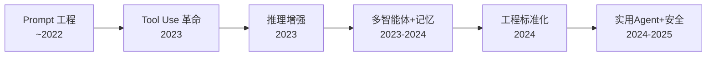

# 🤖 AI Agent 系统性学习路径

> 让 LLM 不只是"聊天"，而是能感知、规划、调用工具、协作行动——从被动问答到主动执行。输入是用户目标/环境状态，输出是工具调用序列/行动计划/最终答案。

---

## 技术演进全景



> 这张图是整份知识库的"地铁线路图"——每次看新模块前，先回到这张图定位自己在哪一站。

---

## 模块划分（6 个正交维度）

| 模块 | 核心问题 | 设计思想 |
|------|---------|---------|
| **01-Agent 基础范式** | LLM 怎么从"只会说话"变成"会调用工具"？ | 用「输出结构化指令 → 解析执行 → 结果反馈」的循环替代纯文本生成——ReAct [[arXiv](https://arxiv.org/abs/2210.03629)] 是核心模式 |
| **02-推理与规划** | 多步复杂任务怎么规划、搜索、纠错？ | 用「多路径探索 + 评估回溯 + 错误反思」替代单线 Chain-of-Thought——把推理看作搜索问题 |
| **03-多智能体系统** | 多个 Agent 怎么分工、沟通、达成共识？ | 用「专业化角色 + 结构化对话 + 动态任务分配」替代单 Agent 包办一切——类比软件开发团队 |
| **04-Agent 记忆与知识** | Agent 怎么记住过去、利用知识、自我进化？ | 用「三级记忆（短/长/反思）+ 检索增强」替代无状态每次从头算——让 Agent 有"经验" |
| **05-工程框架与协议** | Agent 系统怎么设计、集成、标准化、评估？ | 用「统一协议（MCP [[Anthropic](https://www.anthropic.com/news/model-context-protocol)]）+ 可组合框架 + 标准化评估」替代各自为政——让 Agent 可插拔可观测 |
| **06-安全评估与前沿挑战** | Agent 变强了怎么确保它做正确的事？ | 用「权限最小化 + 沙箱隔离 + 人类审批环 + 行为审计」替代放任自治——能力越强越要约束 |

> 模块之间是**正交**的——每个模块回答一个独立问题，可以按任意顺序学习。各模块间没有硬依赖：你完全可以先读 03 再读 02。但**建议 01 → 02 → 04 → 03 → 05 → 06** 的顺序最能建立连贯认知。

---

## 技术演进：6 个范式跃迁

整个领域的历史可以拆成 6 个范式跃迁。每次跃迁都在**解决上一轮留下的麻烦**，同时**引入新的问题**。

### 1. Prompt Engineering 时代（~2022）

| 解决的问题 | 留下的麻烦 |
|-----------|-----------|
| 精心设计的 Prompt 让 LLM 完成简单任务（问答/摘要/翻译）；In-Context Learning 使 LLM 能"现学现用" | 静态 Prompt 无法动态决策；LLM 纯文本输出无法调用外部工具；无法自主感知环境变化 |

### 2. Tool Use 革命（2023）

| 解决的问题 | 留下的麻烦 |
|-----------|-----------|
| Toolformer [[arXiv](https://arxiv.org/abs/2302.04761)] 让 LLM 自己学会决定"是否需要调用API"；ReAct [[arXiv](https://arxiv.org/abs/2210.03629)] 建立了 思考→行动→观察 循环范式；OpenAI Function Calling 使之产品化 | 单步工具调用，无法处理多步骤复杂任务；Agent 仍是"一次调用一次回应"，没有长期推理链；工具调用质量不稳定 |

### 3. 推理增强时代（2023）

| 解决的问题 | 留下的麻烦 |
|-----------|-----------|
| Tree-of-Thoughts 把单线推理扩展为多路径搜索；Reflexion [[arXiv](https://arxiv.org/abs/2303.11366)] 让 Agent 能从错误中反思并自我改进；Plan-and-Solve [[arXiv](https://arxiv.org/abs/2305.04091)] 让 Agent 先规划再执行 | 推理成本大幅上升（多次 LLM 调用）；Agent 仍是单线程的"一个人在战斗"；缺乏长期记忆导致每次从头推理 |

### 4. 多智能体 + 记忆爆发（2023-2024）

| 解决的问题 | 留下的麻烦 |
|-----------|-----------|
| Generative Agents [[arXiv](https://arxiv.org/abs/2304.03442)] 建立完整 Agent 框架（记忆流+反思+社交）；AutoGen [[arXiv](https://arxiv.org/abs/2308.08155)] 实现多 Agent 对话协作；MemGPT [[arXiv](https://arxiv.org/abs/2310.08560)] 赋予 Agent 长期记忆管理能力 | 多 Agent 行为不稳定、通信开销大；框架碎片化（各自为政）；Agent 评估困难——怎么才算"好 Agent"？ |

### 5. 工程标准化时代（2024）

| 解决的问题 | 留下的麻烦 |
|-----------|-----------|
| MCP [[Anthropic](https://www.anthropic.com/news/model-context-protocol)] 协议统一工具接口标准；LangChain/AutoGen [[arXiv](https://arxiv.org/abs/2308.08155)]/CrewAI 等框架成熟；AgentBench [[arXiv](https://arxiv.org/abs/2308.03688)]/WebArena [[arXiv](https://arxiv.org/abs/2307.13854)] 等评估基准出现 | 安全问题凸显（Prompt 注入/工具滥用）；Agent 自主性难以控制；幻觉在 Agent 场景中被放大 |

### 6. 实用 Agent + 安全对齐（2024-2025）

| 解决的问题 | 留下的麻烦 |
|-----------|-----------|
| Cline/Devin/Cursor 等编码 Agent 证明实用性；Computer Use 让 Agent 操作浏览器/桌面；安全研究开始起步 | 长期自主仍是开放问题；Agent 评估体系远不成熟；安全边界（什么让 Agent 自己做、什么必须人批）无共识 |

> 这个演进表是整份知识库的**主轴**——每个模块的细节都应该能映射到这个时间线上。如果你读到一个概念不知道"它出现在哪个阶段、为了解决什么"，说明还没读透。

---

## 四大模块拆解

一个现代 AI Agent 系统可以从四个层次来理解：

### 1. 感知 / 输入层：LLM 理解目标与环境

Agent 的输入不仅仅是用户的一句话，还包括环境状态（文件系统、浏览器 DOM、API 响应等）。

- **ReAct [[arXiv](https://arxiv.org/abs/2210.03629)] (Yao 2023)**：把思考链和行动交错，让 LLM 在"想"和"做"之间切换
- **Function Calling (OpenAI 2023)**：结构化定义工具接口，LLM 输出标准 JSON 指令
- **重要原则**：输入越结构化（而非纯自然语言），Agent 执行越稳定

### 2. 核心范式层：三大决策模式

| 范式 | 核心优点 | 核心代价 | 关键约束 |
|------|---------|---------|---------|
| **ReAct [[arXiv](https://arxiv.org/abs/2210.03629)] 循环**（思考→行动→观察） | 简单直观，容易实现和调试 | 线性执行，无法并行探索 | ✅ 大多数场景可用 |
| **Planning 优先**（先规划再执行） | 全局视角，避免局部最优 | 规划可能跟不上环境变化 | ⚠️ 适合确定性任务 |
| **搜索式推理**（多路径并行） | 探索更广空间，准确率高 | 调用成本与路径数正比 | ⚠️ 适合高准确率场景 |

**一个贯穿所有范式的设计轴：探索深度 vs. 响应速度。** 探索越深，正确率越高，但延迟和成本也越高。

### 3. 工具抽象层：从硬编码到 MCP [[Anthropic](https://www.anthropic.com/news/model-context-protocol)] 协议

| 阶段 | 年份 | 贡献 | 局限 |
|------|------|------|------|
| **硬编码工具** | ~2022 | 每个工具手写调用逻辑 | 不可复用，每项目重写 |
| **Function Calling** | 2023 | OpenAI 标准化工具描述格式 | 绑定单一模型，非通用 |
| **Toolformer [[arXiv](https://arxiv.org/abs/2302.04761)] 自学习** | 2023 | LLM 自己学会"什么场景调什么工具" | 自举训练复杂，不实用 |
| **MCP [[Anthropic](https://www.anthropic.com/news/model-context-protocol)] 协议** | 2024 | 工具即服务，统一注册/发现/调用接口 | 生态仍在建设，需要 Server 端适配 |

**MCP [[Anthropic](https://www.anthropic.com/news/model-context-protocol)] 协议是 2024 年至今的工具集成事实标准。** 核心思想：工具是独立服务，通过标准协议注册和调用，Agent 端和工具端解耦。

### 4. 数据范式层：Agent 的训练数据从哪来

```
你有多少 Agent 训练数据？
├── < 100 条 → Prompt Engineering + Few-shot
├── 100~1000 条 → 微调（SFT）一个专用 Tool-Use 模型
├── 1000~10000 条 → 用 ReAct [[arXiv](https://arxiv.org/abs/2210.03629)] 轨迹数据训练完整 Agent
└── > 10000 条 → 基于 RL 的 Agent 优化（工具调用奖励）
```

> Agent 领域的大多数实践落在"< 100 条"区间——所以目前主流是 Prompt Engineering + Function Calling，而非训练专用模型。Gorilla [[arXiv](https://arxiv.org/abs/2305.15334)] (2023) 证明了检索增强可以让 API 调用不依赖微调。

---

## 学习路径设计

### 目标用户画像

> 用户背景：已经熟悉 LLM 基础知识（Transformer / 预训练 / 推理），想在 AI Agent 方向上建立系统理解

| 你已经熟悉的 | 你需要补齐的 |
|-------------|-------------|
| LLM 的文本生成和对话能力 | Agent 的感知-规划-行动循环（ReAct [[arXiv](https://arxiv.org/abs/2210.03629)]） |
| Prompt Engineering / CoT 等提示技巧 | 结构化工具调用（Function Calling / MCP [[Anthropic](https://www.anthropic.com/news/model-context-protocol)]） |
| RAG [[arXiv](https://arxiv.org/abs/2005.11401)] 基础概念 | 多 Agent 协作的通信和任务分配机制 |
| — | Agent 的安全风险和对齐挑战 |
| — | Agent 评估体系（Benchmark 现状和局限） |

### 建议的学习顺序

```
1. **01-Agent 基础范式**——和你现有 LLM 知识距离最近，重点补 ReAct [[arXiv](https://arxiv.org/abs/2210.03629)] 循环 + Function Calling
   ↓
2. **02-推理与规划**——从"单步调用"到"多步推理"，理解 ToT [[arXiv](https://arxiv.org/abs/2305.10601)] 和 Reflexion [[arXiv](https://arxiv.org/abs/2303.11366)]
   ↓
3. **04-Agent 记忆与知识**——Agent 怎么记住过去、利用外部知识
   ↓
4. **03-多智能体系统**——从单 Agent 到多 Agent 协作
   ↓
5. **05-工程框架与协议**——MCP [[Anthropic](https://www.anthropic.com/news/model-context-protocol)] 协议 + 主流框架 + 评估工具
   ↓
6. **06-安全评估与前沿挑战**——了解安全风险 + 开放问题 + 未来方向
```

---

## 当前前沿：2024-2025 仍然没解决的具体痛点

- **长期自主性**：Agent 在开放环境中连续运作数小时/数天的可靠性仍远不够。当前极限是「几分钟的任务」，长期自主 Agent 的核心瓶颈是错误累积和幻觉自我强化。
- **Agent 评估体系缺失**：LLM 评估已经成熟（MMLU/GSM8K），但 Agent 评估需要"环境+任务+交互"的综合基准——目前 AgentBench [[arXiv](https://arxiv.org/abs/2308.03688)]/WebArena [[arXiv](https://arxiv.org/abs/2307.13854)] 覆盖场景有限，且难以评估长期行为。
- **安全护栏不成熟**：Prompt 注入在 Agent 场景中被放大——如果 Agent 调用了恶意工具，后果更严重。当前的安全方案（权限过滤/敏感词检测）对复杂攻击无效。
- **多模态 Agent 尚在早期**：Computer Use 等操作 GUI 的 Agent 刚起步，UI 理解的可靠性和泛化性差。
- **工具调用幻觉**：LLM 在"是否该调工具、传什么参数"上仍然会出错，且错误难以通过常规对齐方法消除。
- **评价体系问题**：Agent 领域的评估指标刚从"LLM 指标"迁移到"任务完成率"，但对多步推理的中间过程质量仍然缺乏有效度量。

---

## 论文总览

| 模块 | 核心篇数 | 拓展篇数 | 核心论文 |
|------|---------|---------|---------|
| 01-Agent 基础范式 | 3 | 1 | Yao (2023) ReAct [[arXiv](https://arxiv.org/abs/2210.03629)], Schick (2023) Toolformer [[arXiv](https://arxiv.org/abs/2302.04761)], Patil (2023) Gorilla [[arXiv](https://arxiv.org/abs/2305.15334)] |
| 02-推理与规划 | 4 | 2 | Wang (2022) CoT [[arXiv](https://arxiv.org/abs/2201.11903)], Wang (2022) CoT-SC [[arXiv](https://arxiv.org/abs/2203.11171)], Yao (2023) ToT [[arXiv](https://arxiv.org/abs/2305.10601)], Shinn (2023) Reflexion [[arXiv](https://arxiv.org/abs/2303.11366)] |
| 03-多智能体系统 | 3 | 4 | Park (2023) Generative Agents [[arXiv](https://arxiv.org/abs/2304.03442)], Wu (2023) AutoGen [[arXiv](https://arxiv.org/abs/2308.08155)], Hong (2023) MetaGPT [[arXiv](https://arxiv.org/abs/2308.00352)] |
| 04-Agent 记忆与知识 | 3 | 2 | Lewis (2020) RAG [[arXiv](https://arxiv.org/abs/2005.11401)], Packer (2023) MemGPT [[arXiv](https://arxiv.org/abs/2310.08560)], Madaan (2023) Self-Refine [[arXiv](https://arxiv.org/abs/2303.17651)] |
| 05-工程框架与协议 | 3 | 1 | Xi (2023) Agent Survey [[arXiv](https://arxiv.org/abs/2309.07864)], Qin (2023) ToolLLM [[arXiv](https://arxiv.org/abs/2307.16789)], Liu (2023) AgentBench [[arXiv](https://arxiv.org/abs/2308.03688)] |
| 06-安全评估与前沿挑战 | 3 | 4 | Zhou (2023) WebArena [[arXiv](https://arxiv.org/abs/2307.13854)], LLM Safety Survey (2024) [[arXiv](https://arxiv.org/abs/2412.17686)], GUI Agents Survey (2024) [[arXiv](https://arxiv.org/abs/2412.13501)] |
| **合计** | **19** | **14** | **共计 33 篇论文，筛选标准：每模块 3-4 篇覆盖范式节点** |

> 筛选原则：每模块只保留**节点性论文**（提出新范式的第一篇 / 验证可行性的第一篇 / 事实标准的奠基篇）。拓展论文不移除，放在各模块的 `拓展/` 文件夹下。

