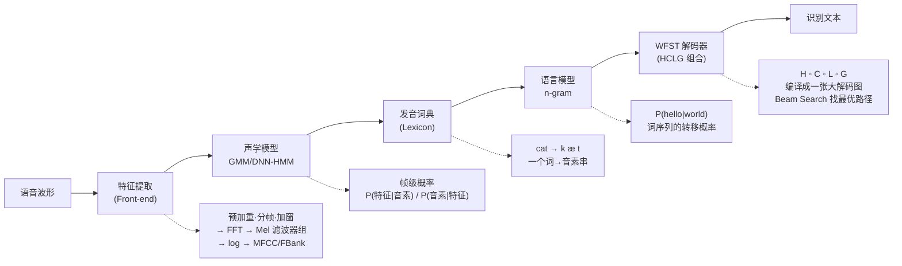
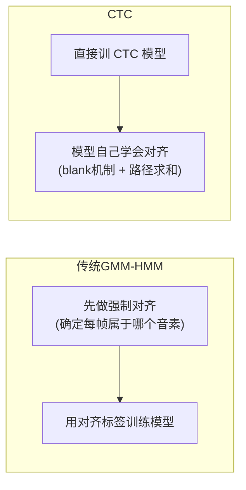
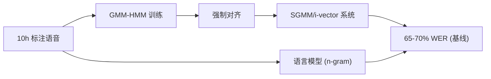

# 02 — HMM 的遗产

## 在端到端之前，ASR 是怎么装的？

现在你做一个 ASR 系统可能就是"对着 FBank 跑一个 Conformer，接 CTC 或 RNNT，训一个模型完事"。但回到 2012 年以前，事情远没这么简单——当时整个 ASR 系统得拼好几块：

1. **声学模型**（当时是 GMM，后来变成 DNN）——负责说"这段语音听起来像是音素 /a/"
2. **发音词典**——负责说"这个词 /hello/ 对应 h-h-e-l-l-ou 这一串音素"
3. **语言模型**（n-gram）——负责说"hello 后面跟着 world 的概率比 hello 后面跟着 elephant 高"
4. **解码器**（WFST 图）——负责把上面三个东西融在一起，找到一条最优路径

这四个东西是各自独立训练、独立调参的，然后用 WFST 的 HCLG 组合编译成一张大的解码图。每一步都有专门的团队在维护：声学团队调 GMM 的混合数，语音团队调词典的读音变体，LM 团队调 n-gram 的裁剪阈值……过程极其复杂，每个组件都要专家，出了问题很难定位。

DNN 的介入其实最开始不是要"推翻这套框架"，而是一种更温和的替代。2012 年 Dahl 在微软的论文其实就问了一个很简单的问题："我们把 GMM 换成 DNN 来做音素后验概率估计，会不会更好？" 结果证明 DNN 全面超越了 GMM——从此混合系统从 GMM-HMM 变成了 DNN-HMM。

但直到端到端出现之前，这套"混合"的本质没有变：声学模型和语言模型还是两个不同的模型，各自独立调优。端到端 ASR 的突破在于：**一个模型，一口吃进来**——不再需要 WFST，不再需要独立的发音词典（端到端系统自己学音素到字的映射），甚至不再需要显式的语言模型（虽然加一个还是有用）。

**那为什么还要学这套老东西？** 两个现实原因：第一，很多工具链里做强制对齐（Forced Alignment）还是用 GMM-HMM 的传统流程——比如你手里有一堆语音和对应文本，要用对齐来生成 CTC 训练的帧级标签；第二，你理解了对齐为什么曾经是个麻烦事，才能理解 CTC 为什么是个突破。

## 全景架构图

下面这张图把整个传统 ASR 流程串起来，建议你在读后续内容时反复回来看：



### 特征提取（Front-end）—— 文档里被跳过的一环

传统 ASR 的第一步不是声学模型，而是**把原始语音波形变成计算机能处理的向量序列**：

1. **预加重**：补偿高频信号的衰减（发 /s/ 这样的音高频能量大，但麦克风录下来往往偏弱）
2. **分帧**：把波形切成 25ms 左右的小段，每 10ms 移动一次（重叠 15ms）→ 一秒钟语音变成大约 100 帧
3. **加窗**（Hamming/Hann 窗）：减少帧边界处的频谱泄露
4. **FFT**（快速傅里叶变换）：把时域信号转成频域（能量按频率分布）
5. **Mel 滤波器组**：模拟人耳对不同频率的敏感度（低频分辨力高，高频分辨力低）
6. **取 log**：压缩动态范围
7. **DCT**（可选）：MFCC 多加一步去相关；FBank 则省略这一步，保留更多信息

> **理解关键**：输出的是一张 **T × D 的矩阵**（T = 帧数，D = 特征维度，通常 40-80）。这就是声学模型的输入。"每一帧"是你的原子单位，后续所有"对齐"的麻烦都源于这里。

### HMM 的三个基本问题 —— 白话版

Rabiner 1989 论文的核心是 HMM 的三个基本问题，这里先给一个直觉：

#### 1. 评估问题（Evaluation）—— "这段语音有多像这个模型？"
> 给定一个 HMM 模型（音素 /a/ 的参数），和一段语音特征，计算这个模型产生这段语音的**概率**。

- 白话：*"这段语音听起来有多像 /a/ ？"*
- 算法：**前向-后向 (Forward-Backward)**
- 用处：训练时计算似然，判断模型拟合得好不好

#### 2. 解码问题（Decoding）—— "这段语音对应什么音素序列？"
> 给定语音特征和一组 HMM（每个音素一个），找到**最可能的音素序列**。

- 白话：*"这段语音最可能是由哪些音素按什么顺序说出来的？"*
- 算法：**Viterbi 算法**
- 用处：推理时做音素识别，训练时做对齐

#### 3. 学习问题（Learning）—— "怎么调参数让模型更准？"
> 给定语音特征和对应的文本，**调整 HMM 参数**（转移概率、发射概率），使 P(特征|模型) 最大化。

- 白话：*"给了一堆 'cat' 的录音，让 HMM 学会 /k/ /æ/ /t/ 分别长什么样、每个音素大概占几帧。"*
- 算法：**Baum-Welch（EM 算法的一种）**
- 用处：训练

> **简单类比**：HMM 就像一个有若干个"隐藏状态"的机器——你可以观测到它的输出（语音特征），但看不到它在哪个状态里。三个问题分别回答：①你处于某状态的概率多大？②你最可能走过了哪些状态？③怎么调机器参数让你下次输出更准？

### 对齐到底麻烦在哪？—— 一个具体例子

理解了帧和 HMM，现在来看"对齐"问题的本质。

你说了一句话 **"cat"**，一共 0.6 秒，按 10ms 一帧就是 **60 帧**。而文本只有 3 个音素：`/k/` `/æ/` `/t/`。

**问题来了：**

```
帧 1  2  3  4  5  6  7  8  9  10  ...  59  60
    ┌─────────────────────────────────────────┐
    │ 这一段到底是 /k/ 还是 /æ/？              │
    │ /k/ 占了 15 帧还是 25 帧？              │
    │ /t/ 从第 50 帧还是第 53 帧开始的？      │
    │ 音素之间有"过渡帧"该归给谁？            │
    └─────────────────────────────────────────┘
```

这个"把 60 帧分配到 3 个音素上"的过程，就是**对齐 (Alignment)**。

在传统系统中，对齐是 GMM-HMM 通过 EM 算法**自动学出来的**，而且学完的对齐结果长这样：

```
帧:  1-18 → /k/   (爆破音，时长变化大)
帧: 19-48 → /æ/   (元音，通常占最长)
帧: 49-60 → /t/   (爆破音，末尾)
```

**为什么这事难？**
- 同一个音素在不同语境下时长差异巨大（/k/ 在快速语速里可能只有 2 帧，慢读时 20 帧）
- 音素之间有协同发音（coarticulation）——/k/ 的发音器官还没到位，/æ/ 的口型已经开始了
- 帧和音素之间没有一一对应关系——你不知道哪个音素对应几帧

**为什么理解了这事，就能理解 CTC 的突破？**

CTC 的核心创新是引入了一个 **blank 符号**，让模型可以自由决定"这一帧是 /k/，这一帧我不确定就输出 blank，那一帧是 /æ/"——不需要事先规定每个音素占几帧。它把"强制路径选择"变成了"软路径概率求和"（forward-backward 对所有可能路径求和），对齐就变成了**学习过程的一个副产品**，而不是一个需要手工设计的步骤。



现在回过头看 Dahl 2012 那句话——DNN 替换 GMM 是声学模型的升级，但"对齐"这个人为设计出来的麻烦，直到 CTC 才真正解决。

## 学习目标

读完你要能：

- 画出一张图：语音 → GMM-HMM 声学模型 → 词典 → n-gram LM → WFST 解码 → 文本
- 说清楚"GMM 做声学建模"和"DNN 做声学建模"的本质区别在哪（判别 vs 生成）
- 理解 WFST 的 HCLG 直觉——不需要会写代码，知道 H→C→L→G 分别是什么就行
- 知道 DNN-HMM 和端到端的根本区别：一个是一堆散件拼起来，一个是一口吃掉

## 精选论文

**Rabiner (1989) "A Tutorial on Hidden Markov Models and Selected Applications in Speech Recognition" [IEEE](https://ieeexplore.ieee.org/document/18626)**

这是一个 70,000+ 引用的论文。你读完前两章（HMM 的三个基本问题和前向后向算法），就已经掌握了传统 ASR 框架最核心的 80%。第三章的 Baum-Welch 可以后面再用到再细看。坦率地说，这篇读起来有些枯燥（毕竟 1989 年的排版和语言风格），但它是这个领域的"必修课"。

**Dahl et al. (2012) "Context-Dependent Pre-Trained Deep Neural Networks for Large-Vocabulary Speech Recognition" [[arXiv](https://arxiv.org/abs/1207.0580)]**

这篇是 DNN 正式取代 GMM 的里程碑。你不需要深究它的预训练细节（现在看已经过时了），重点读它的对比实验——DNN-HMM 比最好的 GMM-HMM 系统提升了多少，为什么会提升。这篇直接告诉你：判别式模型替代生成式模型，是那一轮最大的推动力。

## 拓展阅读

- **Hinton et al. (2012) "Deep Neural Networks for Acoustic Modeling in Speech Recognition" [[arXiv](https://arxiv.org/abs/1207.0580)]** — 这是微软和 Google 联合写的 DNN-HMM 综述，如果你对 DNN-HMM 这段历史感兴趣可以翻翻。
- **Povey et al. (2011) "The Kaldi Speech Recognition Toolkit" [IEEE](https://ieeexplore.ieee.org/document/6163935)** — Kaldi 的论文不是学术突破，但它几乎是传统 ASR 工程的事实标准。如果你工作中需要做强制对齐或 WFST 相关的事情，Kaldi 是绕不开的。
---

## 论文参考

| 论文 | 作者(年份) | 链接 |
|---|---|---|
| Context-Dependent Pre-trained Deep Neural Networks for Large-Vocabulary Speech Recognition | Dahl et al. (2012) | [arXiv](https://arxiv.org/abs/1207.0580) |
| A Tutorial on Hidden Markov Models and Selected Applications in Speech Recognition | Rabiner (1989) | [IEEE](https://ieeexplore.ieee.org/document/18626) |

---

## 本章思考题（附解答）

这些问题按 Bloom 认知层级排列，从复述到评判，适合用作自测或讨论。

### 基础层

#### Q1: 请画出传统 GMM-HMM 系统的完整流程图，标注四个主要组件及其输入输出。

**A:** 特征提取 → 声学模型 (GMM/DNN-HMM) + 发音词典 (Lexicon) + 语言模型 (n-gram) → WFST 解码器 (HCLG 组合) → 文本输出。详细架构图见本章"全景架构图"一节。

WFST 的 HCLG 不是按顺序跑的流水线——而是预先把四个层次**编译成一张巨大的状态图**，解码时只在图上做 beam search。

```
语音 → [特征提取] → ┌──────────────────────────┐ ──→ 文本
                    │  H (HMM 状态拓扑)        │
                    │  C (三音素上下文映射)      │
                    │  L (词典: 词→音素串)      │
                    │  G (文法: n-gram LM)      │
                    └──── H ◦ C ◦ L ◦ G ────────┘
```

---

#### Q2: GMM 和 DNN 在声学建模中的本质区别是什么？

| | GMM-HMM | DNN-HMM |
|---|---|---|
| **建模方向** | 生成式 (Generative) | 判别式 (Discriminative) |
| **建模对象** | `P(特征 │ 音素)` — 给定音素，特征长什么样 | `P(音素 │ 特征)` — 给定特征，是哪个音素 |
| **视角** | "这段语音听起来像音素 /a/ 吗？" | "这段语音是 /a/、/b/ 还是 /c/？" |
| **训练目标** | 最大化数据的似然 | 最小化音素分类错误 |

GMM 需要假设特征服从某种分布（高斯），而真实语音的特征分布高度复杂多模态，假设不成立。DNN 不需要这种假设，只需要学会区分不同音素即可。

**类比**：GMM 像是让你"描述一下猫长什么样"（生成），DNN 像是给你一张图片问"这是猫还是狗"（判别）——后者容易得多。

---

#### Q3: WFST 里的 H、C、L、G 分别代表什么？

| 层级 | 全称 | 映射关系 | 作用 |
|---|---|---|---|
| **H** | HMM Structure | HMM 状态间的转移 | 每个音素通常有 3 个状态（自环+跳转），建模音素的时序变化 |
| **C** | Context-dependency | 单音素 → 三音素 | "t" 在 "top" 里和 "stop" 里发音不同，需要看前后音素 |
| **L** | Lexicon | 音素串 → 词 | "k æ t" → "cat"，也包含多发音变体 |
| **G** | Grammar/LM | 词 → 词 | 定义词序列概率，如 bigram 的 P(w₂│w₁) |

**H ◦ C ◦ L ◦ G** 中的 `◦` 是 WFST 的**组合运算 (composition)**——像函数复合一样，把四张图接成一张巨图。解码就是在这张图上从第一帧走到最后一帧，找概率乘积最大的路径。

---

#### Q4: DNN-HMM 混合系统与端到端 ASR 的根本区别在哪？

| 维度 | DNN-HMM | 端到端 (E2E) |
|---|---|---|
| **模型数量** | 3-4 个独立模型 | **一个模型，所有任务** |
| **训练方式** | 各自独立训练 | 联合训练，梯度端到端传播 |
| **对齐** | 需要显式强制对齐 | CTC/RNNT 隐式学习 |
| **发音词典** | 必需（专家维护） | 不是必须的（模型自己学） |
| **解码** | WFST 编译 + beam search | 简单的 beam search / greedy |
| **调参复杂度** | 极高 | 相对低 |
| **数据要求** | 对数据量要求相对低 | 通常需要大量数据 |

"混合"的"混"有两层含义：① 生成式 HMM 框架 + 判别式 DNN 声学模型；② 声学模型和语言模型在解码时通过 WFST 融合。

---

### 应用层

#### Q5: 用 CTC 训练端到端 ASR 需要帧级对齐标签吗？GMM-HMM 在其中扮演什么角色？

**这里有一个常见误解：CTC 训练不需要你手动提供帧级对齐标签**——这是 CTC 最大的突破。你只需要提供语音和转录文本，CTC 的 forward-backward 算法会枚举所有可能的对齐路径来训练。

那 GMM-HMM 的作用是什么？

- **大数据量（几千小时）**：可以跳过 GMM-HMM，模型从随机初始化也能收敛
- **小数据量（几十小时）**：先用 GMM-HMM 做强制对齐得到"粗糙的帧级标签"→ 用这些标签初始化 CTC 模型 → 模型自己精调对齐。这能显著提升收敛速度和最终性能

大多数工程工具链（Kaldi、ESPnet）默认走 GMM-HMM 对齐作为预处理。**不是必须的，但多数场景下仍然值得用**。

> 概括：CTC 不需要人工标注对齐，但在小数据场景下 GMM-HMM 的"廉价但粗糙的对齐"可以给 CTC 一个好的起跑线。

---

#### Q6: 为一个只有 10 小时标注数据的小语种搭建 ASR 系统，你会选哪个方案？

| 方案 | 小数据表现 | 劣势 |
|---|---|---|
| **GMM-HMM** | 可以工作，鲁棒 | 准确率上限低，调参繁琐 |
| **DNN-HMM** | 比 GMM-HMM 好但容易过拟合 | 10h 太少，DNN 容易记住训练集 |
| **端到端** | 基本不可用 | 10h 训不出来（数据饥渴） |

**推荐策略**：GMM-HMM + 子空间 GMM (SGMM)



**进阶选项**：
- 如果有**大量未标注语音**：先训 GMM-HMM 做伪标签 → 伪标签 + 少量标注 → 训小的端到端模型（自训练）
- 如果有**近亲语种数据**：预训练 + 迁移学习

**一句话**：10h 这个量级，GMM-HMM 仍是最务实的选择。端到端是"方向正确，但技术上一时半会用不上"。

---

### 评价层

#### Q7: "DNN 取代 GMM 是一次革命"还是"只是声学模型替换，框架直到端到端才被改变"？

**两者都对，但看的是不同层面。**

**支持"革命"**：Dahl (2012) 在 Switchboard 上把 WER 从 27.4% 降到 18.5%（质的飞跃）；从手工特征分布到神经网络自动学特征；GPU 训练成为主流。

**支持"框架未变"**：DNN-HMM 依旧跑在 HMM 框架里（Viterbi、三音素、WFST 一个没少）；语言模型还是 n-gram，和声学模型分开训；工程基础设施完全一样。

**更准确的表述**：

```
声学模型：  革命 (GMM → DNN)
解码框架：  演进 (还是 HMM + WFST)
语言模型：  不变 (n-gram)
训练流程：  革命 (BP + GPU 替代 EM)
```

Dahl 2012 和端到端论文应被放在两个不同的"革命层级"上来理解。组件层面是一次革命，系统层面是一次演进。

---

#### Q8: Rabiner 1989 的 HMM 思想中，哪些今天还在？哪些被抛弃了？

**仍然存在的遗产：**

| 遗产 | 在端到端中的体现 |
|---|---|
| **时序建模的必要性** | CTC 本质是对帧序列建模，blank + token 替代了 HMM 的隐含状态 |
| **前向-后向算法** | CTC 的 forward-backward 与 HMM 的**数学结构完全一致** |
| **Viterbi 解码** | beam search 解码的鼻祖——端到端的 beam search 就是放宽约束的 Viterbi |
| **强制对齐** | Kaldi / Montreal Forced Aligner 至今仍用 GMM-HMM 做对齐 |

**被抛弃的：**

| 被抛弃的 | 为什么 |
|---|---|
| **马尔可夫假设**（状态只依赖前一状态） | Transformer 的全局注意力彻底抛弃它——端到端模型看整句话的上下文 |
| **人工设计状态拓扑**（每音素 3 状态+自环/跳转） | CTC/RNNT 不需要人工设计状态拓扑 |
| **发射概率的分布假设**（GMM 假设高斯） | DNN 直接输出 softmax |
| **独立组件**（声学/词典/LM 分开） | 端到端一个模型包揽所有 |
| **词典**（音素→词的映射） | 端到端通常用 BPE/子词直接建模 |

**一个有趣的观察**：HMM 的三大问题在端到端框架中以另一种形式继续存在：

```
HMM 的三个问题          端到端的对应
──────────────────────────────────────────
评估: P(语音│模型)  →  损失函数 (CTC loss)
解码: argmax(音素│语音) →  beam search 解码
学习: EM 调参        →  BP + 梯度下降
```

数学本质没变，只是实现工具从概率图模型换成了神经网络。

---
