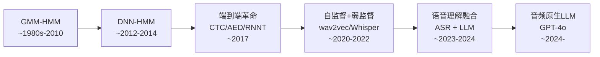
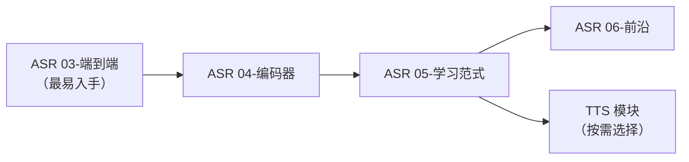

# 🎤 语音领域（Audio）系统性学习路径

> 语音是人类最自然的交互方式——从"听见声音"（ASR）到"说出声音"（TTS），覆盖了语音信号处理的完整链路。输入是音频波形，输出是对应的文本（ASR）或合成语音（TTS）。

---

## 技术演进全景

> 这张图聚焦 ASR（语音识别）的主线演进。TTS 侧有独立的演进路径，参见 TTS/ 模块。

---

## 两大子领域

| 子领域 | 核心问题 | 技术主线 | 路径 |
|--------|---------|---------|------|
| **ASR（自动语音识别）** | 把语音波形转成文本 | GMM-HMM → DNN-HMM → 端到端(CTC/AED/RNNT) → 自监督(wav2vec/Whisper) → 音频LLM | ASR/ |
| **TTS（语音合成）** | 把文本转成自然语音 | 拼接合成 → 统计参数 → WaveNet → 自回归/非自回归 → 统一端到端(VITS) → 大模型零样本(VALL-E) | TTS/ |

---

## 模块划分

### ASR（6 个模块）

| 模块 | 核心问题 |
|------|---------|
| **01-前端信号处理** | 波形→特征（MFCC/FBank）的经典 pipeline |
| **02-经典统计框架** | GMM-HMM 对齐方案 + WFST 解码图 |
| **03-端到端训练准则** | CTC / AED / RNNT 三种范式对比 |
| **04-编码器架构** | RNN → Speech-Transformer → Conformer |
| **05-学习范式** | 自监督(wav2vec/HuBERT) vs 弱监督(Whisper) |
| **06-前沿专题** | 流式 ASR / 音频 LLM / 多说话人 |

### TTS（6 个模块）

| 模块 | 核心问题 |
|------|---------|
| **01-文本前端** | 文本规范化、G2P、韵律预测 |
| **02-声学建模** | AR vs NAR vs Flow 建模范式 |
| **03-波形生成** | WaveNet → GAN → Flow 声码器 |
| **04-统一端到端** | VITS / NaturalSpeech 合并管线 |
| **05-大模型与零样本** | VALL-E / CosyVoice 新范式 |
| **06-可控性与个性化** | 风格/情感/说话人控制 |

---

## 论文总览

| 子领域 | 核心篇数 | 拓展篇数 | 时间跨度 |
|--------|---------|---------|---------|
| ASR | 19 | 5 | 1980-2024 |
| TTS | 14 | 8 | 2016-2024 |
| **合计** | **33** | **13** | **1980-2024** |

> 详细论文列表见各子领域根 README。

---

## 当前前沿（2024-2026 仍未解决的问题）

- **Whisper 幻觉**：静音段编造文本，被 LLM 放大
- **多说话人 ASR**：重叠语音 WER ~30%（单人 ~5%）
- **发音幻觉与稳定性**：大模型 TTS 读错低频词汇
- **实时音频 LLM 延迟**：端到端音频交互的工程瓶颈
- **韵律多样性与精细控制**：非自回归 TTS 平均化问题
- **评价体系滞后**：WER/MOS 在"理解"层面不再足够

---

## 建议学习顺序

> 建议先从 ASR 入手（和 CV/NLP 距离近），再根据兴趣扩展到 TTS。各模块的详细 README 中有完整的技术演进 + 论文列表 + 学习路径。
