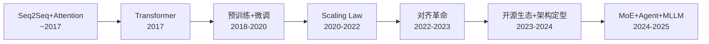

# 大语言模型（LLM）系统性学习路径

> 基于 Transformer 架构的大规模语言模型——从注意力机制的数学原理到 Agent 系统的工程实践。输入是文本序列，输出是文本生成 / 推理决策 / 多模态理解。

---

## 技术演进全景

> 这张图是整份知识库的"地铁线路图"——每次看新模块前，先回到这张图定位自己在哪一站。

---

## 模块划分（6 个正交维度）

| 模块 | 核心问题 | 设计思想 |
|------|---------|---------|
| **01-Transformer 起源** | Attention 机制为什么能取代 RNN？ | 用「全连接的位置相关性」替代「隐状态的序列传递」——完全并行化是核心 |
| **02-架构演进迭代** | 从原始 Transformer 到 LLaMA，6 年改了哪 5 个关键组件？ | 每个组件从「能用」到「好用」的精细迭代，互不依赖 |
| **03-训练与对齐范式** | 怎么让 LLM 从「背语料」到「听人话」？ | 预训练学知识 → SFT 学格式 → RLHF/DPO 学偏好，三层递进 |
| **04-推理与部署优化** | 几百 GB 的模型怎么在实际场景跑起来？ | 空间换时间（KV Cache）+ 精度换速度（量化）+ 虚拟内存（PagedAttention） |
| **05-应用技术** | 怎么让 LLM 在真实任务中可靠工作？ | 外部知识注入（RAG）+ 推理能力激发（CoT）+ Prompt Engineering |
| **06-前沿方向** | LLM 的下一步往哪走？ | 稀疏激活突破参数限制（MoE）+ 自主决策（Agent）+ 多模态融合（MLLM） |

> 模块之间是**正交**的——每个模块回答一个独立问题，可以按任意顺序学习。01 和 02 之间较弱依赖（先理解原始 Transformer 再看改进更顺），其余模块均可并行。

---

## 技术演进：7 个范式跃迁

整个领域的历史可以拆成 7 个范式跃迁。每次跃迁都在**解决上一轮留下的麻烦**，同时**引入新的问题**。

### 1. Seq2Seq + Attention 时代

| 解决的问题 | 留下的麻烦 |
|-----------|-----------|
| RNN 能处理变长序列，Attention 缓解了长距离遗忘问题 | 序列依赖使训练无法并行；长程依赖仍会衰减；时间步线性不可绕过 |

### 2. Transformer 革命（2017）

| 解决的问题 | 留下的麻烦 |
|-----------|-----------|
| Self-Attention 实现完全并行化，所有位置直接交互；O(1) 路径长度彻底解决长程遗忘 | Self-Attention 的 O(n²) 复杂度成为新瓶颈；模型没有位置感必须加编码；深层训练不稳定 |

### 3. 预训练 + 微调范式（2018-2020）

| 解决的问题 | 留下的麻烦 |
|-----------|-----------|
| GPT / BERT 证明无监督预训练 + 有监督微调的有效性；一个模型适配多种下游任务 | 每项任务都要微调成本高；Encoder-only 和 Decoder-only 路线分歧；涌现能力是意外发现不可控 |

### 4. Scaling Law 时代（2020-2022）

| 解决的问题 | 留下的麻烦 |
|-----------|-----------|
| GPT-3 证明「模型够大 → 能力涌现」；In-Context Learning 使推理时无需微调 | 训练成本爆炸（GPT-3 ≈ .6M）；模型越大越难对齐；幻觉、有害输出等安全问题凸显 |

### 5. 对齐革命（2022-2023）

| 解决的问题 | 留下的麻烦 |
|-----------|-----------|
| InstructGPT 用 RLHF 让模型遵循人类指令；ChatGPT 验证产品化可行性 | RLHF 流程复杂（4 个模型 + PPO 不稳定）；DPO 虽简化仍需大量偏好数据；开源社区追赶需低成本对齐方案 |

### 6. 开源生态 + 架构定型（2023-2024）

| 解决的问题 | 留下的麻烦 |
|-----------|-----------|
| LLaMA 证明「小模型 + 更多数据 + 更久训练」也能强；RoPE + GQA + SwiGLU + RMSNorm 组合成为事实标准 | LLaMA 系列架构趋同差异化空间变小；推理成本仍是产品化核心壁垒；长上下文（128K+）仍受限于注意力复杂度 |

### 7. MoE + Agent + MLLM（2024-2025）

| 解决的问题 | 留下的麻烦 |
|-----------|-----------|
| MoE 用稀疏激活突破参数限制（Mixtral 8×7B 仅激活 12.9B）；ReAct Agent 打开 LLM + 工具调用的新维度 | MoE 路由不均衡 / 额外通信开销；Agent 可靠性无保证（错误积累）；评估体系远落后于实践；多模态融合深度不够 |

> 这个演进表是整份知识库的**主轴**——每个模块的细节都应该能映射到这个时间线上。如果你读到一个概念不知道"它出现在哪个阶段、为了解决什么"，说明还没读透。

---

## 四大模块拆解

一个现代 LLM 系统可以从四个层次来理解：

### 1. 信号 / 输入层：文本怎么变成向量

文本 → Tokenization（BPE / SentencePiece / TikToken）→ Token Embedding → Position Encoding（Abs / RoPE / ALiBi / YaRN）→ 模型输入张量 [batch, seq_len, d_model]

- **RoFormer / RoPE**（2021）：可外推的相对位置编码，LLaMA/Qwen/DeepSeek 全系列标配
- **ALiBi**（2022）：用注意力偏置替代位置编码，简化设计但外推不如 RoPE
- **YaRN**（2023）：NTK-aware 长度外推方法，让 RoPE 从 4K 外推到 128K

**核心权衡**：Token 粒度越细越灵活但序列越长，位置编码越复杂可外推性越好但实现成本越高。

### 2. 核心范式层：Encoder-only / Decoder-only / Encoder-Decoder 三派

| 范式 | 核心优点 | 核心代价 | 关键约束 |
|------|---------|---------|---------|
| **Encoder-only** | 双向上下文，理解能力最强 | 不能做生成任务 | ❌ 非自回归 |
| **Decoder-only** | 统一预训练 + 生成，Scaling 最顺畅 | 单向注意力损失一些理解精度 | ✅ **当前事实标准** |
| **Encoder-Decoder** | 编码器双向 + 解码器自回归，灵活度最高 | 参数翻倍，复杂度高 | ❌ 工业界少用 |

**一个贯穿所有范式的设计轴：理解深度 ↔ 生成能力的权衡。Decoder-only 胜出的原因并非它理解力最强，而是架构最简单→最容易 Scaling→Scaling 带来的能力增益超过了单向注意力的损失。**

### 3. 模型架构层：从原始 Transformer 到现代标准配置

| 组件 | 原始 Transformer (2017) | 关键改进 | 现代标准 (2023-) |
|------|------------------------|---------|-----------------|
| 位置编码 | Sinusoidal | → RoPE (2021) | RoPE |
| 注意力计算 | 标准实现（O(n²)） | → FlashAttention (2022) | FlashAttention |
| 注意力头设计 | MHA（全部头独立） | → GQA (2023) | GQA |
| 归一化 | Post-LayerNorm | → Pre-RMSNorm (2019) | RMSNorm |
| 激活函数 | ReLU | → SwiGLU (2020) | SwiGLU |

**RoPE + GQA + SwiGLU + RMSNorm + FlashAttention** 是 2023 年至今的事实标准。LLaMA 3 / Qwen 2.5 / DeepSeek V2 共享这套配置。后续变体（MLA / Mamba / BitNet）主要是效率优化，没有突破性的 idea 变化。

### 4. 数据范式层：数据不够怎么办

`
你有多少标注数据？
├── < 100 → Prompt Engineering（Zero-shot / Few-shot / CoT）
│   ╰ 不需要训练，靠 ICL 激发能力
├── 100 ~ 1,000 → LoRA / Adapter 微调
│   ╰ 冻结大部分参数，只训低秩适配器
├── 1,000 ~ 10,000 → SFT + DPO
│   ╰ 先微调指令格式，再用偏好优化对齐
└── > 10,000 → 全参数微调 / 继续预训练
    ╰ 数据质量比数量更重要（LIMA 原则：1,000 高质量样本就够了）
`

---

## 学习路径设计

### 目标用户画像

> 用户背景：有深度学习基础（BP / CNN / RNN），了解 NLP 基本概念（Word2Vec / Seq2Seq / Attention），能用 Python + PyTorch 跑模型。目标不是「会用 API」而是「理解每个技术节点为什么出现在这个时候」。

| 你已经熟悉的 | 你需要补齐的 |
|-------------|-------------|
| 神经网络基础（BP / 激活函数 / 归一化） | Transformer 注意力的矩阵运算细节 + O(n²) 的来源 |
| RNN / LSTM 序列建模 | 为什么 Self-Attention 彻底取代了它们 |
| PyTorch 基本使用（训练 / 推理） | 现代 LLM 的训练对齐全流程（SFT → RLHF → DPO） |
| 传统 NLP 任务（分类 / 序列标注） | 生成式模型的评估方法 + 涌现能力是什么 |
| — | LLM 推理的工程挑战（显存 / 延迟 / 吞吐） |
| — | 应用范式（RAG / CoT / Agent） |

### 建议的学习顺序

`
路径 A：从零开始系统学习（推荐）
1. **01-Transformer 起源**——建立原始架构的完整认知
   ↓
2. **02-架构演进迭代**——理解现代 LLM 为什么长这样
   ↓
3. **03-训练与对齐范式**——理解 ChatGPT 怎么训出来的
   ↓
4. **04-推理与部署优化**——理解怎么部署和加速
   ↓
5. **05-应用技术**——理解怎么用好 LLM
   ↓
6. **06-前沿方向**——理解下一步去哪

路径 B：已有 LLM 使用经验，想补原理
1. **02-架构演进迭代**——快速过标准配置
   ↓
2. **03-训练与对齐范式**——重点看 RLHF vs DPO
   ↓
3. **04-推理与部署优化**——重点看量化 + PagedAttention
   ↓
4. **01-Transformer 起源**——选读，补注意力细节

路径 C：偏工程部署，想快速落地
1. **04-推理与部署优化**——最高优先级
   ↓
2. **05-应用技术**——RAG + Prompt Engineering
   ↓
3. **02-架构演进迭代**——理解性能瓶颈的来源
`

---

## 当前前沿：2024-2025 仍然没解决的具体痛点

- **推理效率瓶颈**：长上下文推理仍是 O(n²)，KV Cache 随序列长度线性增长。FlashAttention 缓解了训练问题但推理场景的 Cache 管理仍在发展中。这是上一轮 Transformer 架构自己带来的新麻烦。
- **评估体系滞后于实践**：MMLU / GSM8K 等 Benchmark 趋于饱和，Agent 场景的评估尚未形成共识标准。为什么到现在还是难题？开放式任务天生难做自动评估。
- **对齐的成本困境**：RLHF 需要 4 个模型且训练不稳定，DPO 虽简化但偏好边界仍不清晰——模型学会「不说错话」但没学会「什么该说」。为什么难？对齐本质是价值判断，没有数学上最优解。
- **幻觉根源未解**：RAG 缓解了事实性错误但模型仍会「自信地编造」。这是自回归生成「自洽优先于事实」的固有倾向——next token prediction 和「说真话」不是同一个目标函数。
- **Agent 可靠性**：ReAct / Function Calling 打开了 LLM + 工具的维度，但单步错误会积累、工具调用失败无优雅恢复。为什么难？Agent 是开环系统，而 LLM 只有「概率」没有「确定性保证」。
- **评价体系问题**：现有 Benchmark（MMLU / GSM8K / HumanEval）趋于饱和，新范式（Agent / Tool Use）的评估指标尚未形成共识，导致不同论文之间难以公平对比。

---

## 论文总览

| 模块 | 核心篇数 | 核心论文 |
|------|---------|----------|
| 01-Transformer 起源 | 1 | Vaswani (2017) [[arXiv](https://arxiv.org/abs/1706.03762)] Attention Is All You Need |
| 02-架构演进迭代 | 5 | Su (2021) RoPE [[arXiv](https://arxiv.org/abs/2104.09864)], Dao (2022) FlashAttention [[arXiv](https://arxiv.org/abs/2205.14135)], Ainslie (2023) GQA [[arXiv](https://arxiv.org/abs/2305.13245)], Zhang (2019) RMSNorm [[arXiv](https://arxiv.org/abs/1910.07467)], Shazeer (2020) SwiGLU [[arXiv](https://arxiv.org/abs/2002.05202)] |
| 03-训练与对齐范式 | 3 | Brown (2020) GPT-3 [[arXiv](https://arxiv.org/abs/2005.14165)], Ouyang (2022) InstructGPT [[arXiv](https://arxiv.org/abs/2203.02155)], Rafailov (2023) DPO [[arXiv](https://arxiv.org/abs/2305.18290)] |
| 04-推理与部署优化 | 2 | Kwon (2023) PagedAttention [[arXiv](https://arxiv.org/abs/2309.06180)], Frantar (2023) GPTQ [[arXiv](https://arxiv.org/abs/2210.17323)] |
| 05-应用技术 | 2 | Lewis (2020) RAG [[arXiv](https://arxiv.org/abs/2005.11401)], Wei (2022) CoT [[arXiv](https://arxiv.org/abs/2201.11903)] |
| 06-前沿方向 | 2 | Jiang (2024) Mixtral MoE [[arXiv](https://arxiv.org/abs/2401.04088)], Yao (2023) ReAct [[arXiv](https://arxiv.org/abs/2210.03629)] |
| 06-前沿方向 (2025-) | 4 | DeepSeek R1 [[arXiv](https://arxiv.org/abs/2501.12948)], DeepSeek V3 [[arXiv](https://arxiv.org/abs/2412.19437)], GPT-4o [[OpenAI](https://openai.com/index/hello-gpt-4o/)], Claude 4 [[Anthropic](https://www.anthropic.com/news/claude-4)] |
| **合计** | **19** | **扩展到 2025-2026 关键进展** |

