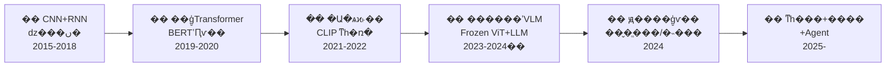
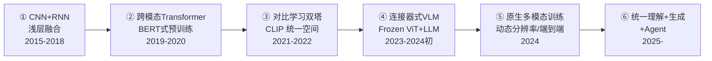

<<<<<<< HEAD
# ??? ��ģ̬ / �Ӿ�-���� (Multimodal / Vision-Language) ϵͳ��ѧϰ��ϵ

> ��ģ��ͬʱ����Ӿ������ԣ����Ӿ�������Ϊ����ˣ�ͨ����ģ̬���뽨����������ռ䣬���� LLM �ں�ʵ��ͼ������������Ի������ɡ�

---

## �����ݽ�ȫ��



> ����ͼ������֪ʶ���"������·ͼ"����ÿ�ο���ģ��ǰ���Ȼص�����ͼ��λ�Լ�����һվ��

---

## ģ�黮�֣�6 ������ά�ȣ�

| ģ�� | �������� | ���˼�� |
|------|---------|---------|
| **01-�Ӿ�������** | ͼ����ô���ģ���ܴ�����������У� | �Ӿ��źŵ����ֻ����룬������ VLM ��"�۾�" |
| **02-��ģ̬����** | ͼ����ı���ôӳ�䵽ͬһ�����������ռ䣿 | ������ģ̬��������ģ�����"ͼ����ı���һ����" |
| **03-��ģ̬�ںϼܹ�** | �Ӿ�������ô�� LLM �ں�ʵ��ͼ����������� | �����Ӿ��������� LLM�������Ӿ���Ϣ����������еIJ��뷽ʽ |
| **04-ѵ���������ģ��** | ��ģ̬ģ����Ҫʲô���ݡ�ѵ����ô scale�� | ������������������ģ�����ޣ�ѵ������Ӱ��Ч�� |
| **05-������ϵ** | ��ô����һ�� VLM ���׺ò��ã� | ����"��"�ı�׼������"ѧ���˴��������" |
| **06-��Ƶ��ģ̬��ǰ����ս** | ��Ƶ����ͼ�������ģ���ǰʲô��û����� | �Ӿ�̬����̬������֪��δ֪����������߽� |

> ģ��֮����**����**�ġ���ÿ��ģ��ش�һ���������⣬���԰�����˳��ѧϰ������Ҫ������ϵ����ģ�� README ��"ģ�������"�б�ע��

---

## �����ݽ���6 ����ʽԾǨ

������ģ̬�Ӿ�-�����������ʷ���Բ�� 6 ����ʽԾǨ��ÿ��ԾǨ����**�����һ�����µ��鷳**��ͬʱ**�����µ�����**��

### 1. CNN �Ӿ� + RNN ���ԣ�dz���ںϣ�2015-2018��

| ��������� | ���µ��鷳 |
|-----------|-----------|
| ����ͼ������һ����CNN ��ȡͼ������ + RNN ����������Show and Tell����VQA ��ע�����ں�˫ģ̬ | �ں�dz�㣨��������㽻������ȱ��Ԥѵ����ʽ��ÿ��������Ҫ������ר�üܹ� |

### 2. ��ģ̬ Transformer Ԥѵ����2019-2020��

| ��������� | ���µ��鷳 |
|-----------|-----------|
| BERT �ijɹ������ViLBERT / LXMERT / UNITER ��ͼ�Ķ��� MLM+ITM Ԥѵ�������˫���ģ̬ע���� | ����Ŀ���⣨Faster R-CNN����Ϊ�Ӿ�������ȡ�����ɱ��ߡ��޷�Ǩ�Ƶ������Ӿ����񣻲������˷�������ģ�� |

### 3. �Ա�ѧϰ˫�����루2021-2022��

| ��������� | ���µ��鷳 |
|-----------|-----------|
| CLIP �� 4 ��ͼ�Ķ� + �Ա���ʧѵ��˫����������ͼ����ı�����ͬһ�����ռ䣬����������/�����������ޣ�ViT ��� CNN ��Ϊͳһ�Ӿ������� | �Աȶ����Ǵ����ȵģ���ͼ?���䣩��ȱ��ϸ������⣨����λ�á�OCR��������ϵ�����޷������ı� |

### 4. ������ʽ VLM��Frozen ViT + Frozen LLM��2023-2024 ����

| ��������� | ���µ��鷳 |
|-----------|-----------|
| LLaVA / BLIP-2 ��������������MLP/Q-Former���ŽӶ���� ViT �Ͷ���� LLM�����󽵵�ѵ���ɱ���֤��"�Ӿ�������+����ģ��"ģ�黯�������� | ��������Ϊ��Ϣƿ�����Ӿ��ֱ������ޣ�2242��3362����ֻ֧�ֵ�ͼ���룻�Ӿ������Եĵ�����Ϣ�� |

### 5. ԭ����ģ̬ѵ����2024��

| ��������� | ���µ��鷳 |
|-----------|-----------|
| InternVL 1.5/2.0 / Qwen2-VL �˵���ѵ�� ViT �� LLM����̬�ֱ��ʡ�ԭ����ͼ֧�֡����� OCR ��ѧ�������ʵ����� | ѵ����������������ģ������ GPU Сʱ������Ƶ�������ƴ��֡��������ʱ��ģ���þ�����δ��� |

### 6. ͳһ��� + ���� + Agent��2025-��

| ��������� | ���µ��鷳 |
|-----------|-----------|
| Emu3 / Show-o / GPT-4o �����������ͳһ��һ���ܹ�����ģ̬ Agent ������GUI ���������ߵ��á�ʵʱ���������ٷ�չ | �ܹ�ͳһ����δ��������ɢ VAE vs ���� diffusion��������Ƶ����Բ����죻��ȫ�����ڿ��� Agent �������� |

> ����ݽ���������֪ʶ���**����**����ÿ��ģ���ϸ�ڶ�Ӧ����ӳ�䵽���ʱ�����ϡ���������һ�����֪��"���������ĸ��׶Ρ�Ϊ�˽��ʲô"��˵����û��͸��

---

## �Ĵ�ܹ����

һ���ִ� VLM ϵͳ���Դ��ĸ��������⣺

### 1. �ź� / ����㣺�Ӿ��źŵ����ֻ�����

ͼ�� �� ���ؾ��� �� Patch ���� �� Transformer ���롣����������"��ô�� 2D ���ر�� 1D token ���ж�����ʧ�ռ���Ϣ"��

- **ViT** (2021)������ CNN �� 2D ����ƫ�ã�Patchify �� Transformer ��Ϊ��ʵ��׼
- **Swin** (2021)���㼶ʽ��ע���� + ������λ���ֲ� ViT ȱ���㼶������ȱ��
- **NaViT / AnyRes** (2023-2024)����̬�ֱ������룬���ԭʼ ViT �̶�����ĸ�������

### 2. ���ķ�ʽ�㣺�����Ӿ�-�����ں�·��

| ��ʽ | �����ŵ� | ���Ĵ��� | �ؼ�Լ�� |
|------|---------|---------|---------|
| **˫���Ա�ʽ** (CLIP) | �����졢����������ǿ��ѵ���ɹ�ģ�� | �����ȡ��������� | ? ��ҵ��ѡ |
| **������ʽ** (LLaVA/BLIP-2) | ѵ�����ˡ��ɸ������� LLM | ��Ϣƿ������ͼ | ? VLM ��ʵ��׼ |
| **ԭ����ģ̬** (InternVL/Qwen2-VL) | �����ܡ���ͼ���߷ֱ��� | ѵ�����󡢼ܹ����� | ?? ǰ�ط��� |

**һ���ᴩ���з�ʽ������᣺�Ӿ���Ϣ��ѹ���ʡ�** ѹ��Խ�ࣨCLIP �� token�����������õ�ϸ�ڶ�ʧ��ѹ��Խ�٣�ViT ȫ���� + Q-Former ɸѡ����ϸ�ڱ���õ���������

### 3. ������ / ģ�ͼܹ��㣺�Ӵ� ViT �� Q-Former �ĵ���

| �ܹ� | ��� | ���� | ���� |
|------|------|------|------|
| ViT | 2021 | Patchify + Transformer ��� CNN | ȱ���㼶�������̶��ֱ��� |
| CLIP ViT | 2021 | ˫���Ա�ѧϰ��text encoder + image encoder | �����ȶ��� |
| Q-Former | 2023 | ��ѧϰ query �Ӷ��� ViT ����ȡ��Ϣ | query ��������Ϣ�� |
| MLP Projector | 2023 | �����������ViT��LLM ֱ�� | ����ӳ���������� |
| Large ViT (InternViT) | 2024 | �� ViT (6B) + �˵��� LLM ѵ�� | ��������� |

**MLP Projector + LLM** �� 2023 ���������ʵ�ںϱ�׼��Q-Former �� cross-attention ����Ҫ����������������ó�����

### 4. ���ݷ�ʽ�㣺���ݲ�����ô��

```
���ж��ٸ�������ͼ�Ķ������ݣ�
������ < 100 ��� �� ������ CLIP embedding �� Zero-Shot Ǩ��
������ 100 �� ~ 1 ǧ��� �� �ÿ�Դ VLM ����ָ������ + ����΢��
������ 1 ǧ�� ~ 5 ǧ��� �� �� BLIP CapFilt / DataComp �����Զ���ϴ����ǿ
������ > 5 ǧ��� �� �˵���ѵ���Լ��� VLM / ̽�� Scaling Law
=======
#  多模态 / 视觉-语言 (Multimodal / Vision-Language) 系统性学习体系

> 让模型同时理解视觉和语言：以视觉编码器为输入端，通过跨模态对齐建立共享语义空间，再与 LLM 融合实现图文联合推理、对话与生成。

---

## 技术演进全景



> 这张图是整份知识库的"地铁线路图"——每次看新模块前，先回到这张图定位自己在哪一站。

---

## 模块划分（6 个正交维度）

| 模块 | 核心问题 | 设计思想 |
|------|---------|---------|
| **01-视觉编码器** | 图像怎么变成模型能处理的向量序列？ | 视觉信号的数字化编码，是整个 VLM 的"眼睛" |
| **02-跨模态对齐** | 图像和文本怎么映射到同一个语义向量空间？ | 建立跨模态桥梁，让模型理解"图像和文本是一回事" |
| **03-多模态融合架构** | 视觉特征怎么和 LLM 融合实现图文联合推理？ | 连接视觉编码器与 LLM，决定视觉信息在推理过程中的参与方式 |
| **04-训练数据与规模化** | 多模态模型需要什么数据、训练怎么 scale？ | 数据质量×数量决定模型上限，训练策略影响效率 |
| **05-评估体系** | 怎么衡量一个 VLM 到底好不好？ | 定义"好"的标准，避免"学到了错误的能力" |
| **06-视频多模态与前沿挑战** | 视频理解比图像难在哪？当前什么还没解决？ | 从静态到动态，从已知到未知，划定领域边界 |

> 模块之间是**正交**的——每个模块回答一个独立问题，可以按任意顺序学习。若需要依赖关系，在模块 README 的"模块间连接"中标注。

---

## 技术演进：6 个范式跃迁

整个多模态视觉-语言领域的历史可以拆成 6 个范式跃迁。每次跃迁都在**解决上一轮留下的麻烦**，同时**引入新的问题**。

### 1. CNN 视觉 + RNN 语言：浅层融合（2015-2018）

| 解决的问题 | 留下的麻烦 |
|-----------|-----------|
| 迈出图文理解第一步：CNN 提取图像特征 + RNN 生成描述（Show and Tell），VQA 用注意力融合双模态 | 融合浅层（仅在输出层交互）、缺乏预训练范式、每个任务需要单独的专用架构 |

### 2. 跨模态 Transformer 预训练（2019-2020）

| 解决的问题 | 留下的麻烦 |
|-----------|-----------|
| BERT 的成功启发：ViLBERT / LXMERT / UNITER 对图文对做 MLM+ITM 预训练，深度双向跨模态注意力 | 依赖目标检测（Faster R-CNN）作为视觉特征提取器，成本高、无法迁移到其他视觉任务；参数量浪费在冗余模块 |

### 3. 对比学习双塔对齐（2021-2022）

| 解决的问题 | 留下的麻烦 |
|-----------|-----------|
| CLIP 用 4 亿图文对 + 对比损失训练双塔编码器，图像和文本共享同一向量空间，零样本分类/检索能力惊艳；ViT 替代 CNN 作为统一视觉编码器 | 对比对齐是粗粒度的（整图?整句），缺乏细粒度理解（物体位置、OCR、多对象关系）；无法生成文本 |

### 4. 连接器式 VLM：Frozen ViT + Frozen LLM（2023-2024 初）

| 解决的问题 | 留下的麻烦 |
|-----------|-----------|
| LLaVA / BLIP-2 用轻量连接器（MLP/Q-Former）桥接冻结的 ViT 和冻结的 LLM，极大降低训练成本，证明"视觉编码器+语言模型"模块化方案可行 | 连接器成为信息瓶颈；视觉分辨率受限（2242→3362）；只支持单图输入；视觉到语言的单向信息流 |

### 5. 原生多模态训练（2024）

| 解决的问题 | 留下的麻烦 |
|-----------|-----------|
| InternVL 1.5/2.0 / Qwen2-VL 端到端训练 ViT 与 LLM，动态分辨率、原生多图支持、高清 OCR 数学能力获质的提升 | 训练计算量剧增（单模型数万 GPU 小时）；视频理解仍是拼接帧而非真正时序建模；幻觉问题未解决 |

### 6. 统一理解 + 生成 + Agent（2025-）

| 解决的问题 | 留下的麻烦 |
|-----------|-----------|
| Emu3 / Show-o / GPT-4o 将理解与生成统一到一个架构，多模态 Agent 能力（GUI 操作、工具调用、实时交互）快速发展 | 架构统一方案未收敛（离散 VAE vs 连续 diffusion）；长视频理解仍不成熟；安全对齐在开放 Agent 场景更难 |

> 这个演进表是整份知识库的**主轴**——每个模块的细节都应该能映射到这个时间线上。如果你读到一个概念不知道"它出现在哪个阶段、为了解决什么"，说明还没读透。

---

## 四大架构拆解

一个现代 VLM 系统可以从四个层次来理解：

### 1. 信号 / 输入层：视觉信号的数字化编码

图像 → 像素矩阵 → Patch 序列 → Transformer 编码。核心问题是"怎么把 2D 像素变成 1D token 序列而不丢失空间信息"。

- **ViT** (2021)：打破 CNN 的 2D 归纳偏置，Patchify → Transformer 成为事实标准
- **Swin** (2021)：层级式自注意力 + 窗口移位，弥补 ViT 缺乏层级特征的缺陷
- **NaViT / AnyRes** (2023-2024)：动态分辨率输入，解决原始 ViT 固定输入的刚性限制

### 2. 核心范式层：三大视觉-语言融合路线

| 范式 | 核心优点 | 核心代价 | 关键约束 |
|------|---------|---------|---------|
| **双塔对比式** (CLIP) | 检索快、零样本分类强、训练可规模化 | 粗粒度、不能生成 | ? 工业首选 |
| **连接器式** (LLaVA/BLIP-2) | 训练便宜、可复用现有 LLM | 信息瓶颈、单图 | ? VLM 事实标准 |
| **原生多模态** (InternVL/Qwen2-VL) | 高性能、多图、高分辨率 | 训练极贵、架构锁定 | ?? 前沿方向 |

**一个贯穿所有范式的设计轴：视觉信息的压缩率。** 压缩越多（CLIP 单 token），语义对齐好但细节丢失；压缩越少（ViT 全序列 + Q-Former 筛选），细节保留好但计算量大。

### 3. 编码器 / 模型架构层：从纯 ViT 到 Q-Former 的迭代

| 架构 | 年份 | 贡献 | 局限 |
|------|------|------|------|
| ViT | 2021 | Patchify + Transformer 替代 CNN | 缺乏层级特征、固定分辨率 |
| CLIP ViT | 2021 | 双塔对比学习，text encoder + image encoder | 粗粒度对齐 |
| Q-Former | 2023 | 可学习 query 从冻结 ViT 中提取信息 | query 数限制信息量 |
| MLP Projector | 2023 | 最简连接器，ViT→LLM 直连 | 线性映射能力有限 |
| Large ViT (InternViT) | 2024 | 大 ViT (6B) + 端到端 LLM 训练 | 计算需求大 |

**MLP Projector + LLM** 是 2023 年至今的事实融合标准。Q-Former 和 cross-attention 是重要替代方案，各有适用场景。

### 4. 数据范式层：数据不够怎么办

```
你有多少高质量的图文对齐数据？
├── < 100 万对 → 用已有 CLIP embedding 做 Zero-Shot 迁移
├── 100 万 ~ 1 千万对 → 用开源 VLM 生成指令数据 + 领域微调
├── 1 千万 ~ 5 千万对 → 用 BLIP CapFilt / DataComp 策略自动清洗和增强
└── > 5 千万对 → 端到端训练自己的 VLM / 探索 Scaling Law
>>>>>>> ed5a13ae57486cc9b30618d399e96de2238a7ebe
```

---

<<<<<<< HEAD
## ѧϰ·�����

### Ŀ���û�����

> �û���������һ�����ѧϰ��������Ϥ CNN / RNN / Transformer �Ļ���������� NLP �˽���� CV����ϵͳ���ն�ģ̬�Ӿ�-����ģ�͡�

| ���Ѿ���Ϥ�� | ����Ҫ����� |
|-------------|-------------|
| Transformer �ܹ� (Attention / Encoder-Decoder) | ViT �� Patchify + Position Embedding ��� |
| LLM �Ļ���ѵ�����̣�Ԥѵ�� / SFT / RLHF�� | �Ӿ��������� LLM ���ںϷ�ʽ��Projector / Q-Former�� |
| ����/���ȱ�׼ CV ���� | ��ģ̬����ĶԱ�ѧϰ��ʧ��InfoNCE / Sigmoid Loss�� |
| �� | ��ģ̬������ϵ���ĸ� benchmark ��ʲô������|
| �� | ��Ƶ��ģ̬��ʱ��ģ��ս |

### �����ѧϰ˳��

```
1. **01-�Ӿ�������**�����������е� CV ֪ʶ��ӽ������ ViT ���ȡ�� CNN
   ��
2. **02-��ģ̬����**�����ӵ�ģ̬��˫ģ̬��CLIP �ĶԱ�ѧϰ�ǹؼ�ת�۵�
   ��
3. **03-��ģ̬�ںϼܹ�**�����������ݣ��Ӿ���Ϣ���� LLM �ļ��ַ�ʽ
   ��
4. **04-ѵ���������ģ��**����ѧ���ںϼܹ������������ξ���ģ������
   ��
5. **05-������ϵ**����ѧ�����ĸ� VLM ǿ������������� benchmark ֪ʶ��
   ��
6. **06-��Ƶ��ģ̬��ǰ����ս**�����Ӿ�̬����̬���Լ�����ǰ�Ŀ�������
=======
## 学习路径设计

### 目标用户画像

> 用户背景：有一定深度学习基础（熟悉 CNN / RNN / Transformer 的基本概念），对 NLP 了解多于 CV，想系统掌握多模态视觉-语言模型。

| 你已经熟悉的 | 你需要补齐的 |
|-------------|-------------|
| Transformer 架构 (Attention / Encoder-Decoder) | ViT 的 Patchify + Position Embedding 设计 |
| LLM 的基本训练流程（预训练 / SFT / RLHF） | 视觉编码器与 LLM 的融合方式（Projector / Q-Former） |
| 分类/检测等标准 CV 任务 | 跨模态对齐的对比学习损失（InfoNCE / Sigmoid Loss） |
| — | 多模态评估体系（哪个 benchmark 测什么能力）|
| — | 视频多模态的时序建模挑战 |

### 建议的学习顺序

```
1. **01-视觉编码器**——和你现有的 CV 知识最接近，理解 ViT 如何取代 CNN
   ↓
2. **02-跨模态对齐**——从单模态到双模态，CLIP 的对比学习是关键转折点
   ↓
3. **03-多模态融合架构**——核心内容！视觉信息进入 LLM 的几种方式
   ↓
4. **04-训练数据与规模化**——学完融合架构后，理解数据如何决定模型上限
   ↓
5. **05-评估体系**——学会辨别哪个 VLM 强在哪里（附带大量 benchmark 知识）
   ↓
6. **06-视频多模态与前沿挑战**——从静态到动态，以及领域当前的开放问题
>>>>>>> ed5a13ae57486cc9b30618d399e96de2238a7ebe
```

---

<<<<<<< HEAD
## ��ǰǰ�أ�2025-2026 ��Ȼû����ľ���ʹ��

- **ϸ���Ȼþ�**��VLM �Կռ��ϵ��"è��������߻����ұ�"����������"��������"�������԰󶨣�"��ɫ�������Ա�����ɫ����"����ϵͳ�Իþ�������������ʽ VLM ѹ���Ӿ���Ϣʱ������鷳
- **��Ƶʱ��ģ**����ǰ Video-LLM ���ֻ��֡ƴ�� + ֡�� attention��ȱ��������ʱ������������ϵ���¼��߽��⣩��Ϊʲô���������⣺��Ƶ���ݱ�ע�ɱ�̫�ߡ�ʱ��ѹ��������Ϣ�����ì���޽�
- **ͳһ�ܹ�δ����**������ɢ token��VAR / VQ-VAE���������� diffusion��DiT����ͳһ��ܸ��ã��󳧸���������OpenAI=������Meta=��ɢ��Gemini=��ϣ������� Transformer �� NLP �е�"һ�Ҷ���"
- **�����ѷ�����**��������ͼ�ĶԵ�"�컨��"���ڵ�����Natural language supervision ����֮�����������������ޣ����ϳ����ݣ�SynthDog / ��Ⱦ���ݣ�������̽����δ����ȫ��֤��·��
- **����ɱ�����**������ VLM��GPT-4V/o / Gemini Ultra / InternVL 6B����ѵ���ɱ������������뿪Դ��������������"VLM �Ĵ�ģ��¢��"��������
- **������ϵ�ͺ�**��MMMU / MMBench �Ȼ�׼������й¶�� contamination ���ٱ��ͣ��� benchmark��MMMU-Pro / MMLMM-Pro����׷�ϵ���ʵ���������Բ����ƣ�Human eval �ɱ�̫��

---

## ��������
> ���� 9 ƪ �� ��չ 2 ƪ �� ʱ���ȣ�2021-2024

| ģ�� | ����ƪ�� | ��չƪ�� | �������� |
|------|---------|---------|---------|
| 01-�Ӿ������� | 3 | 2-3 | ViT(2021) [[arXiv](https://arxiv.org/abs/2010.11929)], Swin(2021) [[arXiv](https://arxiv.org/abs/2103.14030)], EVA-02(2023) [[arXiv](https://arxiv.org/abs/2303.11331)] |
| 02-��ģ̬���� | 4 | 2-3 | CLIP(2021), SigLIP(2023), BLIP(2022), DataComp(2023) |
| 03-��ģ̬�ںϼܹ� | 5 | 2-3 | LLaVA(2023) [[arXiv](https://arxiv.org/abs/2304.08485)], LLaVA-1.5(2024) [[arXiv](https://arxiv.org/abs/2310.03744)], BLIP-2(2023) [[arXiv](https://arxiv.org/abs/2301.12597)], InternVL(2024) [[arXiv](https://arxiv.org/abs/2312.14238)], Qwen-VL(2024) [[arXiv](https://arxiv.org/abs/2308.12966)] |
| 04-ѵ���������ģ�� | 3 | 2-3 | DataComp(2023), LLaVA�������(2024), Scaling Laws for VLMs(2024) |
| 05-������ϵ | 3 | 2 | MMBench(2023), MMMU(2024), MMVP(2024) |
| 06-��Ƶ��ģ̬��ǰ����ս | 3 | 2 | ImageBind(2023), Video-LLaMA(2023), Emu3(2024) |
| **�ϼ�** | **21** | **12-17** | **ɸѡ��׼��ÿģ�� 3-5 ƪ�����Ƿ�ʽ�л��ڵ�** |

> ɸѡԭ��ÿģ��ֻ����**�ڵ�������**������·�ʽ�ĵ�һƪ / ��֤�����Եĵ�һƪ / ��ʵ��׼�ĵ��ƪ������չ���IJ��Ƴ������ڸ�ģ��� `��չ/` �ļ����¡�

---

## ģ����ϵ

```
ͼ�� �� 01 �Ӿ�������(ViT/Swin)
         ��
   02 ��ģ̬����(CLIP/SigLIP) �� 04 ѵ���������ģ��
         ��
   03 ��ģ̬�ںϼܹ�(LLaVA/BLIP-2/InternVL)
         ��           �K
   LLM �� ���      05 ������ϵ(MMBench/MMMU)
         ��
   06 ��Ƶ��ģ̬��ǰ����ս
=======
## 当前前沿：2025-2026 仍然没解决的具体痛点

- **细粒度幻觉**：VLM 对空间关系（"猫在桌子左边还是右边"）、数量（"几个杯子"）、属性绑定（"红色立方体旁边是蓝色球体"）的系统性幻觉。这是连接器式 VLM 压缩视觉信息时引入的麻烦
- **视频时序建模**：当前 Video-LLM 大多只是帧拼接 + 帧间 attention，缺乏真正的时序推理（因果关系、事件边界检测）。为什么至今是难题：视频数据标注成本太高、时序压缩率与信息保留的矛盾无解
- **统一架构未收敛**：是离散 token（VAR / VQ-VAE）还是连续 diffusion（DiT）的统一框架更好？大厂各有立场（OpenAI=连续，Meta=离散，Gemini=混合），不像 Transformer 在 NLP 中的"一家独大"
- **数据匮乏困境**：高质量图文对的"天花板"正在到来（Natural language supervision 论文之后数据质量提升有限），合成数据（SynthDog / 渲染数据）是正在探索但未经完全验证的路径
- **计算成本隔离**：顶尖 VLM（GPT-4V/o / Gemini Ultra / InternVL 6B）的训练成本与数据需求与开源社区差距持续拉大，"VLM 的大模型垄断"趋势明显
- **评价体系滞后**：MMMU / MMBench 等基准因数据泄露和 contamination 快速饱和，新 benchmark（MMMU-Pro / MMLMM-Pro）在追赶但真实能力评估仍不完善；Human eval 成本太高

---

## 论文总览
> 核心 9 篇 · 拓展 2 篇 · 时间跨度：2021-2024

| 模块 | 核心篇数 | 拓展篇数 | 核心论文 |
|------|---------|---------|---------|
| 01-视觉编码器 | 3 | 2-3 | ViT(2021), Swin(2021), EVA-02(2023) |
| 02-跨模态对齐 | 4 | 2-3 | CLIP(2021), SigLIP(2023), BLIP(2022), DataComp(2023) |
| 03-多模态融合架构 | 5 | 2-3 | LLaVA(2023), LLaVA-1.5(2024), BLIP-2(2023), InternVL(2024), Qwen-VL(2024) |
| 04-训练数据与规模化 | 3 | 2-3 | DataComp(2023), LLaVA数据配比(2024), Scaling Laws for VLMs(2024) |
| 05-评估体系 | 3 | 2 | MMBench(2023), MMMU(2024), MMVP(2024) |
| 06-视频多模态与前沿挑战 | 3 | 2 | ImageBind(2023), Video-LLaMA(2023), Emu3(2024) |
| **合计** | **21** | **12-17** | **筛选标准：每模块 3-5 篇，覆盖范式切换节点** |

> 筛选原则：每模块只保留**节点性论文**（提出新范式的第一篇 / 验证可行性的第一篇 / 事实标准的奠基篇）。拓展论文不移除，放在各模块的 `拓展/` 文件夹下。

---

## 模块间关系

```
图像 → 01 视觉编码器(ViT/Swin)
         ↓
   02 跨模态对齐(CLIP/SigLIP) ← 04 训练数据与规模化
         ↓
   03 多模态融合架构(LLaVA/BLIP-2/InternVL)
         ↓           ↘
   LLM → 输出      05 评估体系(MMBench/MMMU)
         ↓
   06 视频多模态与前沿挑战
>>>>>>> ed5a13ae57486cc9b30618d399e96de2238a7ebe
```

---

<<<<<<< HEAD
## �ο������������ӦĿ¼

| ������� | ·�� |
|---------|------|
| LLM������ģ�͵�ѵ��/����/Ӧ�ã� | `E:\����\LLM\` |
| ��ɢģ�� / ͼ�����ɣ�SD ϵ�У� | `E:\����\SD\` |
| AI Agent��Agent ����빤��ʹ�ã� | `E:\����\AI-Agent\` |
| ǿ��ѧϰ��RLHF / ƫ���Ż��� | `E:\����\RL\` |

> ��ģ̬ VLM λ����Щ����Ľ���㣺LLM �ṩ������������ɢģ�����Ӿ����ɣ�Agent ��������ߵ��ã�RL ��ƫ�ö��롣
=======
## 参考：其他领域对应目录

| 相关领域 | 路径 |
|---------|------|
| LLM（语言模型的训练/推理/应用） | `E:\论文\LLM\` |
| 扩散模型 / 图像生成（SD 系列） | `E:\论文\SD\` |
| AI Agent（Agent 框架与工具使用） | `E:\论文\AI-Agent\` |
| 强化学习（RLHF / 偏好优化） | `E:\论文\RL\` |

> 多模态 VLM 位于这些领域的交叉点：LLM 提供语言能力，扩散模型做视觉生成，Agent 框架做工具调用，RL 做偏好对齐。
>>>>>>> ed5a13ae57486cc9b30618d399e96de2238a7ebe

---

