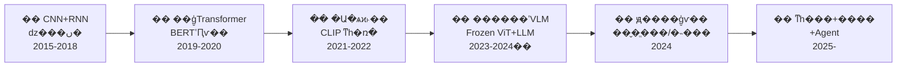

# ??? ��ģ̬ / �Ӿ�-���� (Multimodal / Vision-Language) ϵͳ��ѧϰ��ϵ

> ��ģ��ͬʱ����Ӿ������ԣ����Ӿ�������Ϊ����ˣ�ͨ����ģ̬���뽨����������ռ䣬���� LLM �ں�ʵ��ͼ������������Ի������ɡ�

---

## �����ݽ�ȫ��



> ����ͼ������֪ʶ���"������·ͼ"����ÿ�ο���ģ��ǰ���Ȼص�����ͼ��λ�Լ�����һվ��

---

## ģ�黮�֣�6 ������ά�ȣ�

| ģ�� | �������� | ���˼�� |
|------|---------|---------|
| **01-�Ӿ�������** | ͼ����ô���ģ���ܴ�����������У� | �Ӿ��źŵ����ֻ����룬������ VLM ��"�۾�" |
| **02-��ģ̬����** | ͼ����ı���ôӳ�䵽ͬһ�����������ռ䣿 | ������ģ̬��������ģ�����"ͼ����ı���һ����" |
| **03-��ģ̬�ںϼܹ�** | �Ӿ�������ô�� LLM �ں�ʵ��ͼ����������� | �����Ӿ��������� LLM�������Ӿ���Ϣ����������еIJ��뷽ʽ |
| **04-ѵ���������ģ��** | ��ģ̬ģ����Ҫʲô���ݡ�ѵ����ô scale�� | ������������������ģ�����ޣ�ѵ������Ӱ��Ч�� |
| **05-������ϵ** | ��ô����һ�� VLM ���׺ò��ã� | ����"��"�ı�׼������"ѧ���˴��������" |
| **06-��Ƶ��ģ̬��ǰ����ս** | ��Ƶ����ͼ�������ģ���ǰʲô��û����� | �Ӿ�̬����̬������֪��δ֪����������߽� |

> ģ��֮����**����**�ġ���ÿ��ģ��ش�һ���������⣬���԰�����˳��ѧϰ������Ҫ������ϵ����ģ�� README ��"ģ�������"�б�ע��

---

## �����ݽ���6 ����ʽԾǨ

������ģ̬�Ӿ�-�����������ʷ���Բ�� 6 ����ʽԾǨ��ÿ��ԾǨ����**�����һ�����µ��鷳**��ͬʱ**�����µ�����**��

### 1. CNN �Ӿ� + RNN ���ԣ�dz���ںϣ�2015-2018��

| ��������� | ���µ��鷳 |
|-----------|-----------|
| ����ͼ������һ����CNN ��ȡͼ������ + RNN ����������Show and Tell����VQA ��ע�����ں�˫ģ̬ | �ں�dz�㣨��������㽻������ȱ��Ԥѵ����ʽ��ÿ��������Ҫ������ר�üܹ� |

### 2. ��ģ̬ Transformer Ԥѵ����2019-2020��

| ��������� | ���µ��鷳 |
|-----------|-----------|
| BERT �ijɹ������ViLBERT / LXMERT / UNITER ��ͼ�Ķ��� MLM+ITM Ԥѵ�������˫���ģ̬ע���� | ����Ŀ���⣨Faster R-CNN����Ϊ�Ӿ�������ȡ�����ɱ��ߡ��޷�Ǩ�Ƶ������Ӿ����񣻲������˷�������ģ�� |

### 3. �Ա�ѧϰ˫�����루2021-2022��

| ��������� | ���µ��鷳 |
|-----------|-----------|
| CLIP �� 4 ��ͼ�Ķ� + �Ա���ʧѵ��˫����������ͼ����ı�����ͬһ�����ռ䣬����������/�����������ޣ�ViT ��� CNN ��Ϊͳһ�Ӿ������� | �Աȶ����Ǵ����ȵģ���ͼ?���䣩��ȱ��ϸ������⣨����λ�á�OCR��������ϵ�����޷������ı� |

### 4. ������ʽ VLM��Frozen ViT + Frozen LLM��2023-2024 ����

| ��������� | ���µ��鷳 |
|-----------|-----------|
| LLaVA / BLIP-2 ��������������MLP/Q-Former���ŽӶ���� ViT �Ͷ���� LLM�����󽵵�ѵ���ɱ���֤��"�Ӿ�������+����ģ��"ģ�黯�������� | ��������Ϊ��Ϣƿ�����Ӿ��ֱ������ޣ�2242��3362����ֻ֧�ֵ�ͼ���룻�Ӿ������Եĵ�����Ϣ�� |

### 5. ԭ����ģ̬ѵ����2024��

| ��������� | ���µ��鷳 |
|-----------|-----------|
| InternVL 1.5/2.0 / Qwen2-VL �˵���ѵ�� ViT �� LLM����̬�ֱ��ʡ�ԭ����ͼ֧�֡����� OCR ��ѧ�������ʵ����� | ѵ����������������ģ������ GPU Сʱ������Ƶ�������ƴ��֡��������ʱ��ģ���þ�����δ��� |

### 6. ͳһ��� + ���� + Agent��2025-��

| ��������� | ���µ��鷳 |
|-----------|-----------|
| Emu3 / Show-o / GPT-4o �����������ͳһ��һ���ܹ�����ģ̬ Agent ������GUI ���������ߵ��á�ʵʱ���������ٷ�չ | �ܹ�ͳһ����δ��������ɢ VAE vs ���� diffusion��������Ƶ����Բ����죻��ȫ�����ڿ��� Agent �������� |

> ����ݽ���������֪ʶ���**����**����ÿ��ģ���ϸ�ڶ�Ӧ����ӳ�䵽���ʱ�����ϡ���������һ�����֪��"���������ĸ��׶Ρ�Ϊ�˽��ʲô"��˵����û��͸��

---

## �Ĵ�ܹ����

һ���ִ� VLM ϵͳ���Դ��ĸ��������⣺

### 1. �ź� / ����㣺�Ӿ��źŵ����ֻ�����

ͼ�� �� ���ؾ��� �� Patch ���� �� Transformer ���롣����������"��ô�� 2D ���ر�� 1D token ���ж�����ʧ�ռ���Ϣ"��

- **ViT** (2021)������ CNN �� 2D ����ƫ�ã�Patchify �� Transformer ��Ϊ��ʵ��׼
- **Swin** (2021)���㼶ʽ��ע���� + ������λ���ֲ� ViT ȱ���㼶������ȱ��
- **NaViT / AnyRes** (2023-2024)����̬�ֱ������룬���ԭʼ ViT �̶�����ĸ�������

### 2. ���ķ�ʽ�㣺�����Ӿ�-�����ں�·��

| ��ʽ | �����ŵ� | ���Ĵ��� | �ؼ�Լ�� |
|------|---------|---------|---------|
| **˫���Ա�ʽ** (CLIP) | �����졢����������ǿ��ѵ���ɹ�ģ�� | �����ȡ��������� | ? ��ҵ��ѡ |
| **������ʽ** (LLaVA/BLIP-2) | ѵ�����ˡ��ɸ������� LLM | ��Ϣƿ������ͼ | ? VLM ��ʵ��׼ |
| **ԭ����ģ̬** (InternVL/Qwen2-VL) | �����ܡ���ͼ���߷ֱ��� | ѵ�����󡢼ܹ����� | ?? ǰ�ط��� |

**һ���ᴩ���з�ʽ������᣺�Ӿ���Ϣ��ѹ���ʡ�** ѹ��Խ�ࣨCLIP �� token�����������õ�ϸ�ڶ�ʧ��ѹ��Խ�٣�ViT ȫ���� + Q-Former ɸѡ����ϸ�ڱ���õ���������

### 3. ������ / ģ�ͼܹ��㣺�Ӵ� ViT �� Q-Former �ĵ���

| �ܹ� | ��� | ���� | ���� |
|------|------|------|------|
| ViT | 2021 | Patchify + Transformer ��� CNN | ȱ���㼶�������̶��ֱ��� |
| CLIP ViT | 2021 | ˫���Ա�ѧϰ��text encoder + image encoder | �����ȶ��� |
| Q-Former | 2023 | ��ѧϰ query �Ӷ��� ViT ����ȡ��Ϣ | query ��������Ϣ�� |
| MLP Projector | 2023 | �����������ViT��LLM ֱ�� | ����ӳ���������� |
| Large ViT (InternViT) | 2024 | �� ViT (6B) + �˵��� LLM ѵ�� | ��������� |

**MLP Projector + LLM** �� 2023 ���������ʵ�ںϱ�׼��Q-Former �� cross-attention ����Ҫ����������������ó�����

### 4. ���ݷ�ʽ�㣺���ݲ�����ô��

```
���ж��ٸ�������ͼ�Ķ������ݣ�
������ < 100 ��� �� ������ CLIP embedding �� Zero-Shot Ǩ��
������ 100 �� ~ 1 ǧ��� �� �ÿ�Դ VLM ����ָ������ + ����΢��
������ 1 ǧ�� ~ 5 ǧ��� �� �� BLIP CapFilt / DataComp �����Զ���ϴ����ǿ
������ > 5 ǧ��� �� �˵���ѵ���Լ��� VLM / ̽�� Scaling Law
```

---

## ѧϰ·�����

### Ŀ���û�����

> �û���������һ�����ѧϰ��������Ϥ CNN / RNN / Transformer �Ļ���������� NLP �˽���� CV����ϵͳ���ն�ģ̬�Ӿ�-����ģ�͡�

| ���Ѿ���Ϥ�� | ����Ҫ����� |
|-------------|-------------|
| Transformer �ܹ� (Attention / Encoder-Decoder) | ViT �� Patchify + Position Embedding ��� |
| LLM �Ļ���ѵ�����̣�Ԥѵ�� / SFT / RLHF�� | �Ӿ��������� LLM ���ںϷ�ʽ��Projector / Q-Former�� |
| ����/���ȱ�׼ CV ���� | ��ģ̬����ĶԱ�ѧϰ��ʧ��InfoNCE / Sigmoid Loss�� |
| �� | ��ģ̬������ϵ���ĸ� benchmark ��ʲô������|
| �� | ��Ƶ��ģ̬��ʱ��ģ��ս |

### �����ѧϰ˳��

```
1. **01-�Ӿ�������**�����������е� CV ֪ʶ��ӽ������ ViT ���ȡ�� CNN
   ��
2. **02-��ģ̬����**�����ӵ�ģ̬��˫ģ̬��CLIP �ĶԱ�ѧϰ�ǹؼ�ת�۵�
   ��
3. **03-��ģ̬�ںϼܹ�**�����������ݣ��Ӿ���Ϣ���� LLM �ļ��ַ�ʽ
   ��
4. **04-ѵ���������ģ��**����ѧ���ںϼܹ������������ξ���ģ������
   ��
5. **05-������ϵ**����ѧ�����ĸ� VLM ǿ������������� benchmark ֪ʶ��
   ��
6. **06-��Ƶ��ģ̬��ǰ����ս**�����Ӿ�̬����̬���Լ�����ǰ�Ŀ�������
```

---

## ��ǰǰ�أ�2025-2026 ��Ȼû����ľ���ʹ��

- **ϸ���Ȼþ�**��VLM �Կռ��ϵ��"è��������߻����ұ�"����������"��������"�������԰󶨣�"��ɫ�������Ա�����ɫ����"����ϵͳ�Իþ�������������ʽ VLM ѹ���Ӿ���Ϣʱ������鷳
- **��Ƶʱ��ģ**����ǰ Video-LLM ���ֻ��֡ƴ�� + ֡�� attention��ȱ��������ʱ������������ϵ���¼��߽��⣩��Ϊʲô���������⣺��Ƶ���ݱ�ע�ɱ�̫�ߡ�ʱ��ѹ��������Ϣ�����ì���޽�
- **ͳһ�ܹ�δ����**������ɢ token��VAR / VQ-VAE���������� diffusion��DiT����ͳһ��ܸ��ã��󳧸���������OpenAI=������Meta=��ɢ��Gemini=��ϣ������� Transformer �� NLP �е�"һ�Ҷ���"
- **�����ѷ�����**��������ͼ�ĶԵ�"�컨��"���ڵ�����Natural language supervision ����֮�����������������ޣ����ϳ����ݣ�SynthDog / ��Ⱦ���ݣ�������̽����δ����ȫ��֤��·��
- **����ɱ�����**������ VLM��GPT-4V/o / Gemini Ultra / InternVL 6B����ѵ���ɱ������������뿪Դ��������������"VLM �Ĵ�ģ��¢��"��������
- **������ϵ�ͺ�**��MMMU / MMBench �Ȼ�׼������й¶�� contamination ���ٱ��ͣ��� benchmark��MMMU-Pro / MMLMM-Pro����׷�ϵ���ʵ���������Բ����ƣ�Human eval �ɱ�̫��

---

## ��������
> ���� 9 ƪ �� ��չ 2 ƪ �� ʱ���ȣ�2021-2024

| ģ�� | ����ƪ�� | ��չƪ�� | �������� |
|------|---------|---------|---------|
| 01-�Ӿ������� | 3 | 2-3 | ViT(2021) [[arXiv](https://arxiv.org/abs/2010.11929)], Swin(2021) [[arXiv](https://arxiv.org/abs/2103.14030)], EVA-02(2023) [[arXiv](https://arxiv.org/abs/2303.11331)] |
| 02-��ģ̬���� | 4 | 2-3 | CLIP(2021), SigLIP(2023), BLIP(2022), DataComp(2023) |
| 03-��ģ̬�ںϼܹ� | 5 | 2-3 | LLaVA(2023) [[arXiv](https://arxiv.org/abs/2304.08485)], LLaVA-1.5(2024) [[arXiv](https://arxiv.org/abs/2310.03744)], BLIP-2(2023) [[arXiv](https://arxiv.org/abs/2301.12597)], InternVL(2024) [[arXiv](https://arxiv.org/abs/2312.14238)], Qwen-VL(2024) [[arXiv](https://arxiv.org/abs/2308.12966)] |
| 04-ѵ���������ģ�� | 3 | 2-3 | DataComp(2023), LLaVA�������(2024), Scaling Laws for VLMs(2024) |
| 05-������ϵ | 3 | 2 | MMBench(2023), MMMU(2024), MMVP(2024) |
| 06-��Ƶ��ģ̬��ǰ����ս | 3 | 2 | ImageBind(2023), Video-LLaMA(2023), Emu3(2024) |
| **�ϼ�** | **21** | **12-17** | **ɸѡ��׼��ÿģ�� 3-5 ƪ�����Ƿ�ʽ�л��ڵ�** |

> ɸѡԭ��ÿģ��ֻ����**�ڵ�������**������·�ʽ�ĵ�һƪ / ��֤�����Եĵ�һƪ / ��ʵ��׼�ĵ��ƪ������չ���IJ��Ƴ������ڸ�ģ��� `��չ/` �ļ����¡�

---

## ģ����ϵ

```
ͼ�� �� 01 �Ӿ�������(ViT/Swin)
         ��
   02 ��ģ̬����(CLIP/SigLIP) �� 04 ѵ���������ģ��
         ��
   03 ��ģ̬�ںϼܹ�(LLaVA/BLIP-2/InternVL)
         ��           �K
   LLM �� ���      05 ������ϵ(MMBench/MMMU)
         ��
   06 ��Ƶ��ģ̬��ǰ����ս
```

---

## �ο������������ӦĿ¼

| ������� | ·�� |
|---------|------|
| LLM������ģ�͵�ѵ��/����/Ӧ�ã� | `E:\����\LLM\` |
| ��ɢģ�� / ͼ�����ɣ�SD ϵ�У� | `E:\����\SD\` |
| AI Agent��Agent ����빤��ʹ�ã� | `E:\����\AI-Agent\` |
| ǿ��ѧϰ��RLHF / ƫ���Ż��� | `E:\����\RL\` |

> ��ģ̬ VLM λ����Щ����Ľ���㣺LLM �ṩ������������ɢģ�����Ӿ����ɣ�Agent ��������ߵ��ã�RL ��ƫ�ö��롣

---

