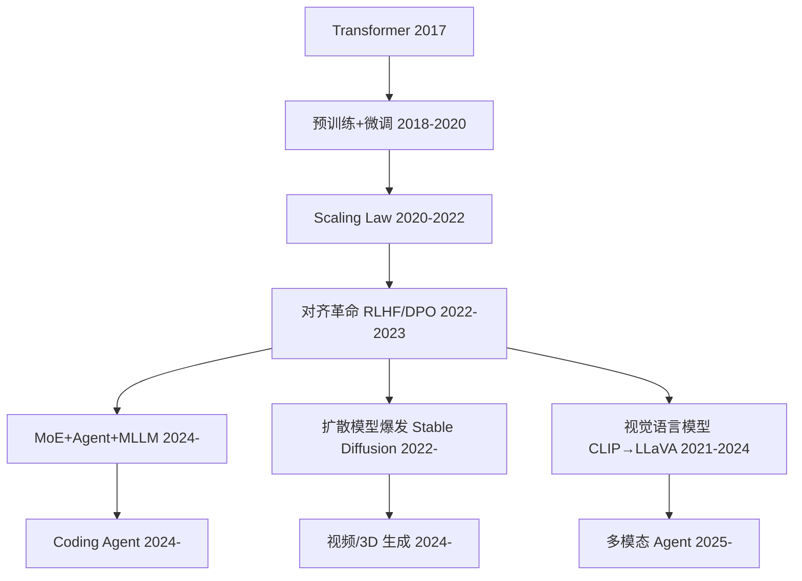

# AI Knowledge Base

> 你让 LLM 查天气，它回复"我不能浏览互联网"——这个仓库就是想让你知道怎么让 LLM 不只是聊天，而是能用工具、做规划、看懂图片、生成内容。

每个方向的笔记都按技术演进的真实脉络展开：**什么东西在什么时间、为了解决什么麻烦出现，又带来了什么新麻烦。**

---

## 一张图看懂这些方向的关系



---

## LLM · 大语言模型

```text
Seq2Seq + Attention (~2017)
  └─ Attention 缓解了 RNN 的长距离遗忘，但序列依赖让训练无法并行
      ↓
Transformer (2017)
  └─ Self-Attention 实现完全并行化，所有位置 O(1) 路径长度
  └─ 但 O(n²) 复杂度成了新瓶颈，模型也没有位置感
      ↓
预训练 + 微调 (2018-2020)
  └─ GPT/BERT 证明无监督预训练 → 有监督微调的有效性
  └─ 但每项任务都要微调成本高，涌现能力是意外发现不可控
      ↓
Scaling Law + GPT-3 (2020-2022)
  └─ 模型够大 → 能力涌现，In-Context Learning 无需微调
  └─ 但训练成本爆炸，模型越大越难对齐
      ↓
对齐革命：InstructGPT / RLHF (2022-2023)
  └─ 让模型遵循人类指令，ChatGPT 验证产品化可行性
  └─ 但 RLHF 流程复杂（4 个模型 + PPO 不稳定）
      ↓
DPO (2023) — 不用 reward model，直接在偏好数据上优化
  └─ 简化了对齐流程，适合开源社区
      ↓
架构定型：RoPE + GQA + SwiGLU + RMSNorm (2023-2024)
  └─ LLaMA 系列形成事实标准配置，几乎所有主流模型共享
  └─ 差异空间变小，推理成本仍是产品化核心壁垒
      ↓
MoE + Agent + MLLM (2024-)
  └─ Mixtral 用稀疏激活突破参数限制，ReAct Agent 打开 LLM+工具维度
  └─ MoE 路由不均衡，Agent 可靠性无保证，多模态融合深度不够
      ↓
DeepSeek R1 (2025) — 开源推理模型 [[arXiv](https://arxiv.org/abs/2501.12948)]
  └─ 核心 ★ GRPO 大规模 RL 训练首次产出可媲美闭源的推理模型
      ↓
GPT-4o / Claude 4 (2025) — 原生多模态 LLM 成熟 [[OpenAI](https://openai.com/index/hello-gpt-4o/) | [Anthropic](https://www.anthropic.com/news/claude-4)]
  └─ 核心 ★ 语音/图像/文本统一处理，多模态不再是"外挂"
      ↓
DeepSeek V3 (2025) — 高效 MoE 训练里程碑 [[arXiv](https://arxiv.org/abs/2412.19437)]
  └─ 核心 ★ 大幅降低 MoE 训练成本，验证"更少算力、更好数据"路线
      ↓
Gemini 2.5 / Llama 4 (2025) — 百万级上下文 + Agent 原生 [[Google](https://blog.google/technology/google-deepmind/gemini-model-thinking-updates-march-2025/) | [Meta](https://ai.meta.com/blog/llama-4-multimodal-intelligence/)]
  └─ 扩展 · 上下文窗口从 128K 迈向 1M+，模型原生支持工具调用
```

## AI-Agent · 智能体

```text
Prompt Engineering (~2022)
  └─ 精心设计 Prompt 让 LLM 完成简单任务，纯文本输出
  └─ 但静态 Prompt 无法动态决策，LLM 纯文本无法调用外部工具
      ↓
ReAct (2023) — 「思考→行动→观察」循环
  └─ LLM 输出结构化指令自己决定调不调 API，Toolformer 自学工具使用
  └─ OpenAI Function Calling 使之产品化，但单步调用无法处理多步任务
      ↓
推理增强：ToT / Reflexion (2023)
  └─ Tree-of-Thoughts 把单线推理变多路径搜索，Reflexion 让 Agent 能反思纠错
  └─ Plan-and-Solve 让 Agent 先规划再执行
  └─ 但推理成本大幅上升，Agent 仍是单线程
      ↓
多智能体爆发：Generative Agents / AutoGen (2023-2024)
  └─ 专业角色分工 + 结构化对话，MemGPT 赋予 Agent 长期记忆
  └─ 但多 Agent 行为不稳定，框架碎片化
      ↓
工程标准化：MCP 协议 (2024)
  └─ 统一工具接口标准，Agent 端和工具端解耦
  └─ AgentBench / WebArena 等评估基准出现
      ↓
实用 Agent + 安全对齐 (2024-)
  └─ Cline/Devin/Cursor 等编码 Agent 证明实用性
  └─ Computer Use 让 Agent 操作浏览器/桌面
  └─ 但长期自主仍是开放问题，安全护栏不成熟
      ↓
OpenAI Deep Research / Anthropic Computer Use (2025) [[OpenAI](https://openai.com/index/introducing-deep-research/) | [Anthropic](https://www.anthropic.com/news/3-5-models-and-computer-use)]
  └─ 核心 ★ Agent 从"调 API"进化到"自主浏览网页/操作桌面/生成报告"
      ↓
OpenAI Agents SDK / Google Agent-to-Agent 协议 (2025) [[OpenAI](https://openai.com/index/new-tools-for-building-agents/) | [Google](https://github.com/google/agent-to-agent)]
  └─ 核心 ★ Agent 开发框架标准化，不同厂商 Agent 开始能互相通信协作
      ↓
MCP 协议广泛采用 (2025) [[Anthropic](https://www.anthropic.com/news/model-context-protocol)]
  └─ 核心 ★ 从 Anthropic 提案变成行业事实标准，工具接口统一化落地
      ↓
Cline / Codex CLI / Cursor Agent 模式 (2025-2026) [[Cline](https://github.com/cline/cline) | [Codex CLI](https://github.com/openai/codex-cli) | [Cursor](https://www.cursor.com/)]
  └─ 扩展 · Coding Agent 从 demo 变成日常开发工具
  └─ 扩展 · Coding Agent 从"demo"变成日常开发工具，AI 写代码占比持续提升
```

## RL · 强化学习

```text
MDP + Bellman 方程 (1950s-1990s)
  └─ 建立了「状态/动作/奖励/转移」的数学框架
  └─ 但真实世界状态空间无限大，表格存不下
      ↓
DQN (2015) — CNN + Experience Replay + Target Network
  └─ 首次证明「神经网络 + RL」在 Atari 上超越人类
  └─ 但 max Q(s') 导致系统性高估，经验回放样本效率低
      ↓
Double DQN (2016) — 解耦动作选择和估计
  └─ 缓解高估偏差，改动极小效果显著
      ↓
TRPO (2015) → PPO (2017) — KL 约束稳定策略更新
  └─ 策略梯度系列的核心突破，PPO 用 clip 简化到极致
  └─ 但仍需 critic 模型
      ↓
DDPG (2016) → SAC (2018) — 扩展到连续控制
  └─ Actor-Critic + 最大熵保证探索，连续控制 SOTA 至今
  └─ 但仍需环境交互，样本效率是根本瓶颈
      ↓
RLHF (2017) → InstructGPT (2022) — RL 对齐 LLM
  └─ 偏好数据 → reward model → PPO，RL 在语言模型上找到全新应用场景
  └─ RLHF 需 4 个模型训练不稳定，奖励作弊随优化变严重
      ↓
DPO (2023) — 不用 reward model，直接在偏好上优化
  └─ 简化了对齐流程，成为开源首选
  └─ 但偏好边界不清晰，模型学会"不说错话"但没学会"什么该说"
      ↓
RLOO (2023) — 用 Leave-One-Out 替代 critic
  └─ 证明了"可以没有 critic"
      ↓
GRPO (2024) — 系统化组归一化，开箱即用 [[arXiv](https://arxiv.org/abs/2402.03300)]
  └─ 去掉了 critic 和 reward model，成为最广泛使用的 RL 训练方案
      ↓
Reinforce++ / DAPO (2025) — GRPO 的工程增强版
  └─ R1 的训练引擎，进一步解耦 policy/reward，优化采样效率
      ↓
推理模型训练范式成熟：o1 / o3 / R1 (2024-2025) [[OpenAI](https://openai.com/index/introducing-openai-o1-preview/) | [DeepSeek](https://arxiv.org/abs/2501.12948)]
  └─ 核心 ★ RL 不再只是"对齐工具"，而是成为模型推理能力本身的核心训练方法
      ↓
GRPO 全面落地 (2025-2026)
  └─ 扩展 · 几乎所有主流开源模型采用 GRPO 或其变体进行对齐训练
```

## MM · 多模态

```text
CNN+RNN 浅层融合 (2015-2018)
  └─ 图像 CNN 提特征 + 文本 RNN 做推理，各自独立输出再拼一起
  └─ 效果差，跨模态信息几乎没有交互
      ↓
跨模态 Transformer (2019-2020)
  └─ ViLBERT/UNITER 用 Transformer 做跨模态编码
  └─ 但仍是"先分别编码再融合"，没有真正统一的语义空间
      ↓
CLIP (2021) — 对比学习双塔
  └─ 4 亿图文对训练，建立统一视觉-语言语义空间
  └─ 但只能做匹配/分类，不能做生成和细粒度推理
      ↓
BLIP-2 / LLaVA (2023) — 「连接器」范式的关键转折
  └─ 冻结大 ViT + 冻结 LLM，只训练一个轻量投影层，效果出奇好
  └─ Qwen-VL / InternVL 陆续跟进，2023-2024 年 VLM 爆发
      ↓
原生多模态训练 (2024-)
  └─ 动态分辨率、端到端训练，统一理解与生成（Emu3）
  └─ 正快速向视频理解和多模态 Agent 方向演进
↓
GPT-4o / Gemini 2.0 原生多模态 (2024-2025) [[OpenAI](https://openai.com/index/hello-gpt-4o/) | [Google](https://blog.google/technology/google-deepmind/gemini-model-thinking-updates-march-2025/)]
  └─ 核心 ★ 语音/图像/文本统一到一个模型中，不再是"视觉编码器 + LLM"的外挂方案
      ↓
Sora / 可灵 / Veo (2024-2025) — 视频生成全面爆发
  └─ 核心 ★ DiT 架构从图像扩展到视频，分钟级高质量视频生成成为可能
      ↓
视频多模态理解成熟 (2025-2026)
  └─ 扩展 · 模型不仅能看懂单张图，还能理解视频中的时序变化和事件逻辑
```

## SD · 扩散模型

```text
DDPM (2020)
  └─ 证明了「加噪声→学去噪」的生成方案可行
  └─ 但采样需要上千步，生成一张图要几分钟
      ↓
DDIM (2021) — 跳步采样
  └─ 把采样步数从 1000 降到 50-100
      ↓
LDM / Stable Diffusion (2022)
  └─ 把扩散过程搬到潜在空间（VAE 压缩），引爆开源生态
      ↓
ControlNet / LoRA (2022-2023)
  └─ ControlNet 用条件图控制生成，LoRA 让微调成本降到一张 GPU
      ↓
CFG (2022) — Classifier-Free Guidance
  └─ 放大条件信号，显著提升生成质量与提示遵循度
  └─ 但过度 CFG 导致色彩过饱和、多样性下降
      ↓
DiT (2023) — Transformer 替代 U-Net
  └─ 扩展性更好，SD3 / Sora 均采用 DiT 路线
      ↓
一致性模型 / LCM (2023)
  └─ 一步/少步生成，推理速度质的飞跃
  └─ 正快速向视频生成和 3D 生成扩展
↓
FLUX.1 / SD3 / Playground v3 (2024) [[Black Forest Labs](https://blackforestlabs.ai/announcements/) | [Stability AI](https://stability.ai/news/stable-diffusion-3)]
  └─ 核心 ★ DiT 架构全面取代 U-Net，图像质量显著提升，提示遵循度大幅改善
      ↓
Sora 类视频生成全面爆发 (2024-2025) [[OpenAI](https://openai.com/index/sora/)]
  └─ 核心 ★ DiT + 时空注意力→视频生成，多个开源方案（CogVideo / Open-Sora / 可灵）跟进
      ↓
3D 生成走向实用 (2025-2026)
  └─ 扩展 · GaussianAnything / Hunyuan3D 等方案让文本/图像到 3D 的生成质量和速度达到可用水平
      ↓
实时生成 / 交互式生成 (2025-)
  └─ 扩展 · 一步生成（一致性模型）+ 实时编辑成为新方向
```

## Audio · 语音

ASR 路线：

```text
HMM/GMM 经典统计框架 (1980s-2010)
  └─ 40 年 ASR 研究的底座
  └─ 声学模型/语言模型分开训，各自需要大量专家知识
      ↓
DNN-HMM 混合模型 (2012)
  └─ 深度学习进入语音，错误率降 30%
  └─ 但仍是"混合"框架，流程复杂
      ↓
端到端路线：CTC → LAS → RNN-T (2006-2017)
  └─ CTC 用"空白帧"绕过对齐，LAS 用 Attention 替代 HMM，RNN-T 支持流式
  └─ 三路线各有取舍——CTC 条件独立假设、LAS 不能流式、RNN-T 实现复杂
      ↓
Conformer (2020) — CNN + Transformer 混合编码器
  └─ 卷积捕获局部 + 注意力捕获全局，ASR 编码器事实标准
      ↓
大规模预训练：wav2vec 2.0 → HuBERT → Whisper (2020-2022)
  └─ 自监督 + 弱监督，零样本泛化远超传统方案
流式多语言模型成熟 (2024-2025) [[arXiv](https://arxiv.org/abs/2410.04487)]
  └─ 扩展 · Whisper 之后的流式方案（SenseVoice / Qwen-Audio）在延迟和准确率上显著提升

GPT-4o 语音模式 / Gemini Live (2024-2025) [[OpenAI](https://openai.com/index/gpt-4o/) | [Google](https://blog.google/products/gemini/gemini-live/)]
  └─ 核心 ★ 语音对话延迟降到 200ms 级，情感/语气/副语言信息被模型理解和生成
```

TTS 路线（与 ASR 并列）：

```text
Tacotron + WaveNet (2017)
  └─ 「谱预测 + 波形生成」两阶段范式
      ↓
FastSpeech (2019) — 非自回归革命
  └─ 推理速度从秒级降到毫秒级
      ↓
VITS (2021) — 端到端
  └─ VAE + GAN 把谱预测和波形生成合成一个模型
      ↓
VALL-E / CosyVoice (2023-2024)
  └─ 神经编解码方案，零样本语音克隆成为可能
  └─ 多语言、自然度大幅提升
GPT-4o 语音模式 (2024-2025) — 语音对话的 ChatGPT 时刻
  └─ 核心 ★ 端到端语音对话延迟降到人类对话水平，情感表达自然

实时语音交互成熟 (2025-2026)
  └─ 扩展 · 语音不再是独立任务，而是多模态交互的默认接口
```

---

## 规模

| 项目 | 数量 |
|------|:----:|
| 系统性笔记（.md） | 57 篇 |
| 可运行代码（.py） | 11 个 |
| 核心论文精读 | 60+ 篇 |
| 扩展论文引用 | 170+ 篇 |

---

## 怎么读

每个子模块的 `README.md` 从一句话直觉开始，按 5 层递进展开：**问题是什么 → 直觉是什么 → 怎么做 → 不同方案怎么选 → 在整个图谱中的位置。**

底部「精选论文」每篇都标注了精读策略：一句话定位 + 重点读哪节 + 精读还是略读。

挑感兴趣的方向，直接进。
