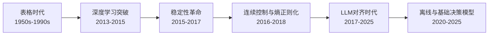

# 🎮 强化学习 (Reinforcement Learning) 系统性学习路径

> 智能体（Agent）通过在动态环境中执行动作、接收奖励反馈，学习最优决策策略——即"从试错中学会最大化累积回报"。

---

## 技术演进全景



> 这张图是整份知识库的"地铁线路图"——每次看新模块前，先回到这张图定位自己在哪一站。

---

## 模块划分（6 个正交维度）

| 模块 | 核心问题 | 设计思想 |
|------|---------|---------|
| **01-基础理论** | MDP、Bellman 方程、动态规划如何为 RL 提供数学框架？ | 公理底座——所有后续方法都建立在同一套数学表述上 |
| **02-深度Q网络** | 神经网络如何替代 Q 表来近似值函数？ | 值函数路线的出发点——用深度网络打破维度诅咒 |
| **03-策略梯度与信任域** | 如何稳定地直接优化策略而非值函数？ | 直接策略路线的出发点——用 KL 约束解决更新稳定性 |
| **04-连续控制与最大熵** | 连续动作空间（如机器人控制）如何做 RL？ | Actor-Critic 架构的完备落点——结合最大熵实现高效探索 |
| **05-RL×LLM** | RL 的思想如何用于大语言模型的对齐与推理训练？ | RL 在 LLM 场景的落地——从 RLHF 到 GRPO |
| **06-离线RL与前沿挑战** | 没有交互环境或仅凭静态数据如何学策略？RL 还有什么做不到？ | 数据驱动决策 + 领域边界——从离线 RL 到开放问题 |

> 模块之间是**正交**的——每个模块回答一个独立问题。建议按 01→02→03→04 顺序打基础，05 和 06 可并行阅读。

---

## 技术演进：6 个范式跃迁

整个领域的历史可以拆成 6 个范式跃迁。每次跃迁都在**解决上一轮留下的麻烦**，同时**引入新的问题**。

### 1. 表格时代（~2013）

| 解决的问题 | 留下的麻烦 |
|-----------|-----------|
| 建立 MDP 数学框架（状态/动作/奖励/转移），Bellman 方程分解长期回报，DP / Q-Learning / TD 给出可实现的求解方法 | 真实世界状态空间无限大，表格存不下；函数近似需要的数学框架尚不成熟 |

### 2. 深度学习突破（2013-2015）

| 解决的问题 | 留下的麻烦 |
|-----------|-----------|
| DQN 用 CNN + Experience Replay + Target Network 首次在 Atari 上超越人类，证明"神经网络 + RL"可行 | Q_target = r + γ·max Q(s') 中的 max 导致系统性高估偏差；经验回放样本效率仍低 |

### 3. 稳定性革命（2015-2017）

| 解决的问题 | 留下的麻烦 |
|-----------|-----------|
| TRPO 用 KL 散度约束策略更新幅度，PPO 用 clip 简化之——稳定策略优化的两座里程碑，PPO 成为 RLHF 基础 | 只支持离散动作；PPO 仍需要 critic 模型，在 LLM 场景下计算开销大 |

### 4. 连续控制与熵正则化（2016-2018）

| 解决的问题 | 留下的麻烦 |
|-----------|-----------|
| DDPG 将 DQN + Actor-Critic 扩展到连续动作空间，SAC 引入最大熵保证探索——连续控制 SOTA | 仍需要环境交互学习，样本效率是根本瓶颈；超参数敏感，复现困难 |

### 5. LLM 对齐时代（2017-2025）

| 解决的问题 | 留下的麻烦 |
|-----------|-----------|
| RLHF 首次将 RL 应用于 LLM 对齐（偏好→reward model→PPO），GRPO 去掉 critic 简化之——RL 在语言模型上获得巨大成功 | 依赖人类偏好标注，成本高；奖励作弊（Reward Hacking）随优化变严重；RL 在 LLM 中的可靠性尚未系统验证 |

### 6. 离线与基础决策模型（2020-2025）

| 解决的问题 | 留下的麻烦 |
|-----------|-----------|
| Offline RL 从静态数据集学策略，CQL/IQL 缓解分布偏移；Decision Transformer 用序列建模替代 Bellman 方程 | 分布外泛化仍未根除；可迁移表示弱；样本效率仍远低于人类——**这是 RL 最根本的局限，所有范式跃迁都在靠近它但从未解决它** |

> 这个演进表是整份知识库的**主轴**——每个模块的细节都应该能映射到这个时间线上。如果你读到一个概念不知道"它出现在哪个阶段、为了解决什么"，说明还没读透。

---

## 四大模块拆解

一个现代 RL 系统可以从四个层次来理解：

### 1. 信号 / 输入层：状态空间与动作空间的表示

RL 的输入是**状态**（state）和**奖励**（reward）。早期用低维特征向量（CartPole 位置/速度），现代用高维像素（Atari 帧）或结构化的 token 序列（LLM 的 token 序列）。关键问题是状态怎么表征、奖励怎么设计。

- **Mnih et al. (2015) DQN**：CNN 直接处理原始像素帧作为状态，开辟端到端 RL 的信号处理范式
- **Christiano et al. (2017) RLHF**：人类偏好转化为可优化的 reward signal，开启 LLM 对齐的信号范式

### 2. 核心范式层：三大流派

| 范式 | 核心优点 | 核心代价 | 关键约束 |
|------|---------|---------|---------|
| **值函数方法 (Value-based)** | 数据利用高效，天然 off-policy | 只能输出离散动作，存在高估偏差 | ✅ Q 函数值域有界 |
| **策略梯度方法 (Policy-gradient)** | 可处理连续/随机策略，收敛性保证更好 | 方差大，样本效率低 | ✅ 需要 baseline 降低方差 |
| **Actor-Critic 混合** | 结合两者优点，SOTA 算法均属此类 | 两个网络同步训练的稳定性挑战 | ✅ 需要信任域 / 熵约束 |

**一个贯穿所有范式的设计轴：探索-利用的权衡（Exploration-Exploitation Tradeoff）。**

### 3. 模型架构层：从全连接到 Transformer 的迭代

| 架构 | 年份 | 贡献 | 局限 |
|------|------|------|------|
| **全连接网络 (MLP)** | ~2013 | 低维状态空间的 Q 近似 | 无法处理高维原始输入 |
| **CNN (DQN)** | 2015 | 原始像素端到端学习 | 只适合空间结构数据 |
| **LSTM (DRQN)** | 2015 | 处理部分可观测 POMDP 场景 | 训练不稳定，梯度问题 |
| **Transformer (Decision Transformer)** | 2021 | 序列建模替代 Bellman 方程，将 RL 视为条件生成 | 违背传统 RL 直觉，尚未变成事实标准 |

**CNN + MLP** 是 2015-2021 年的事实标准。Decision Transformer 的序列建模范式是架构上的突破性想法，但尚未成为新的统治性架构。

### 4. 数据范式层：你有多少交互数据？

```
你有多少环境交互数据？
├── < 1K 步 → 基于模型（Model-based RL）或使用模拟器
├── 1K ~ 100K 步 → SAC / PPO 强探索算法 + 数据增强
├── 100K ~ 1M 步 → 标准 On-policy / Off-policy 算法
└── > 1M 步（静态数据集） → Offline RL / Decision Transformer
```

---

## 学习路径设计

### 目标用户画像

> 用户背景：有 ML/DL 基础，理解基本神经网络和梯度下降，但没有系统学过 RL

| 你已经熟悉的 | 你需要补齐的 |
|-------------|-------------|
| 神经网络的前向传播 + 反向传播 + 梯度下降 | MDP 五元组 (S, A, P, R, γ) 的数学框架与 Bellman 方程 |
| 监督学习的 loss 定义 → 梯度更新 → 收敛 | RL 的试错学习 vs 监督学习的区别（无真实标签，靠奖励信号） |
| 基本概率论（期望/方差/概率分布） | 值函数方法 vs 策略梯度方法的分水岭 |
| — | Actor-Critic 双网络架构的设计直觉 |
| — | 为什么需要信任域 / KL 约束来稳定策略更新 |

### 建议的学习顺序

```
1. **01-基础理论**——MDP 框架 + Bellman 方程，所有后续的数学底座。重点补 Bellman 期望/最优方程的区别
   ↓
2. **02-深度Q网络**——从 DQN 理解"神经网络 + RL"的第一个成功范式。重点补 Experience Replay + Target Network
   ↓
3. **03-策略梯度与信任域**——从"学值函数"到"直接优化策略"的范式切换。重点补 KL 约束 vs Clip 的区别
   ↓
4. **04-连续控制与最大熵**——用 Actor-Critic 把 RL 扩展到连续世界。重点补最大熵与 KL 约束的统一直觉
   ↓
5. **05-RL×LLM**——将前面 PPO / KL 约束思想应用到 LLM 对齐。重点补 GRPO 为什么能去掉 critic
   ↓
6. **06-离线RL与前沿挑战**——了解 RL 的边界。快速过，主要建立领域范围感
```

---

## 当前前沿：2023-2026 仍然没解决的具体痛点

- **可迁移表示**：RL 学到的表示严重依赖当前环境，换一个任务就得重学——不像 CV/NLP 有通用预训练模型。这是"表格时代"留下的根本问题在新范式中从未解决的延续。
- **离线 RL 的分布偏移**：从静态数据集学策略时，学到的 Q 函数在没见过的动作上会异常高估——CQL / IQL 缓解了但没根除。是 Offline RL 落地最大的障碍。
- **奖励作弊（Reward Hacking）**：LLM 场景中，模型会学习"刷奖励"而非真正完成任务——RLHF 的 reward model 被钻空子。这是"LLM 对齐时代"自己带来的新麻烦。
- **样本效率**：当前最好的 RL 算法仍需要百万级交互才能解决一个新任务，人类只需要几十次示范。**这是 RL 最根本的局限，所有范式跃迁都在靠近它但从未解决它。**
- **评价体系问题**：DMC / Atari → LLM benchmark，benchmark 的范式转换滞后于研究进展。LLM 场景还缺乏统一可信的 RL 评估协议。

---

## 论文总览

| 模块 | 核心篇数 | 拓展篇数 | 核心论文 |
|------|---------|---------|---------|
| 01-基础理论 | 2 | 1 | Watkins(1992), Kaelbling(1996) |
| 02-深度Q网络 | 3 | 1 | DQN(2015), Double DQN(2016), Rainbow(2018) |
| 03-策略梯度与信任域 | 4 | 2 | REINFORCE(1992), TRPO(2015), A3C(2016), PPO(2017) |
| 04-连续控制与最大熵 | 3 | 1 | DDPG(2016), TD3(2018), SAC(2018) |
| 05-RL×LLM | 4 | 2 | Christiano(2017), InstructGPT(2022), DPO(2023), GRPO(2024) |
| 06-离线RL与前沿挑战 | 3 | 1 | Offline RL Survey(2020), CQL(2020), Decision Transformer(2021) |
| **合计** | **19** | **8** | **筛选标准：每模块 2-5 篇，覆盖核心节点** |

> 筛选原则：每模块只保留**节点性论文**（提出新范式的第一篇 / 验证可行性的第一篇 / 事实标准的奠基篇）。拓展论文不移除，放在各模块的 `拓展/` 文件夹下。