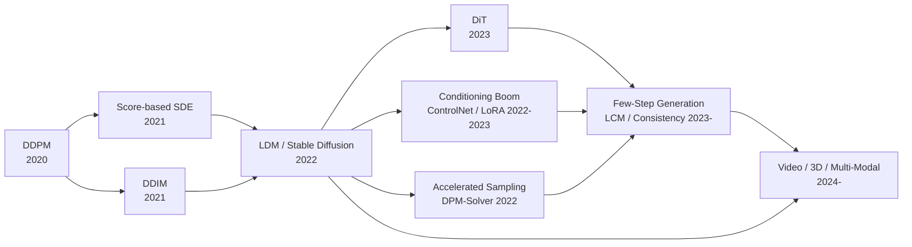

# 扩散模型（Diffusion Models）系统性学习路径

> 从噪声中逐步去噪以生成高质量图像/视频/3D 内容——输入是随机噪声 + 条件信号（文本/图像/控制条件），输出是指定条件约束下的生成结果。

---

## 技术演进全景



> 这张图是整份知识库的"地铁线路图"——每次看新模块前，先回到这张图定位自己在哪一站。

---

## 模块划分（6 个正交维度）

| 模块 | 核心问题 | 设计思想 |
|------|---------|---------|
| **01-扩散理论基础** | 扩散模型为什么能生成数据？ | 概率模型的数学根基：从物理直觉到严格理论 |
| **02-骨干架构演进** | 什么网络结构最适合做去噪？ | 从 U-Net 到 Transformer 的骨架迭代 |
| **03-条件注入机制** | 条件（文本/图像）如何进入去噪过程？ | 模型内部的信号路由设计 |
| **04-可控生成与适配** | 如何精确控制生成内容或适配特定场景？ | 围绕预训练模型的外围控制工具 |
| **05-采样加速与蒸馏** | 怎么让生成更快、步数更少？ | 数值方法与模型蒸馏双路线 |
| **06-多模态扩展** | 扩散模型如何走向视频/3D/多模态？ | 生成范式的跨模态迁移 |

> 模块之间是**正交**的——每个模块回答一个独立问题。01 是理论根基（建议先读），02-05 可按兴趣选读，06 是前沿扩展。如果两个模块有依赖关系，在子模块"模块间连接"标注清楚。

---

## 技术演进：6 个范式跃迁

整个扩散模型领域的历史可以拆成 6 个范式跃迁。每次跃迁都在**解决上一轮留下的麻烦**，同时**引入新的问题**。

### 1. DDPM（2020）——扩散模型的诞生

| 解决的问题 | 留下的麻烦 |
|-----------|-----------|
| 首次证明了加噪-去噪框架可以生成高质量图像。训练稳定（不像 GAN 需要对抗平衡），对数似然优于 VAE。定义了前向扩散 + 反向去噪的标准流程。 | 推理速度极慢——生成一张图需要 1000 步，比 GAN 慢 3 个数量级。对采样步数极度敏感，不支持条件生成。 |

### 2. Score-based SDE + DDIM（2021）——理论统一与加速起点

| 解决的问题 | 留下的麻烦 |
|-----------|-----------|
| **SDE 理论统一**：将 DDPM、Score Matching、概率流 ODE 纳入统一框架，揭示了扩散过程的连续时间本质。**DDIM**：非马尔可夫采样将步数从 1000 降到 50-100 步。 | 降采样步数以质量损失为代价；仍然在像素空间操作，高分辨率（1024²+）计算成本不可接受。条件机制仍很原始（需要额外分类器）。 |

### 3. LDM / Stable Diffusion（2022）——潜空间革命

| 解决的问题 | 留下的麻烦 |
|-----------|-----------|
| 将扩散过程从像素空间转移到 VAE 潜空间，计算量降低 80%+，使高分辨率生成变得实用。引入 Cross-Attention + CLIP 文本编码，实现了灵活的文本条件。开源发布催生了整个生态。 | 使用 U-Net 架构，参数量增长瓶颈明显。文本-图像对齐仍有缺陷。生成速度仍不够快（10-50 步）。 |

### 4. Conditioning Boom（2022-2023）——可控性爆发

| 解决的问题 | 留下的麻烦 |
|-----------|-----------|
| ControlNet 将空间条件控制融入生成。LoRA 实现了轻量级微调。CFG 成为标准条件混合策略。IP-Adapter 实现了图像 prompt 控制。 | 多种控制方法组合复杂，一致性难保证。微调方法碎片化。单个模型无法同时掌握所有控制信号。 |

### 5. DiT + Few-step Generation（2023-）——架构范式转换与实时化

| 解决的问题 | 留下的麻烦 |
|-----------|-----------|
| DiT 证明 Transformer 在扩散模型中符合 Scaling Law，替代 U-Net 成为新一代事实标准。LCM 通过蒸馏实现 1-4 步生成。 | Transformer 推理成本高。Few-step 质量仍逊于多步采样。蒸馏需要大量训练计算。 |

### 6. Video / 3D / Multi-modal（2024-）——当前前沿

| 解决的问题 | 留下的麻烦 |
|-----------|-----------|
| 扩散模型成功迁移到视频（Sora）、3D（DreamFusion, SDS）、多视图生成。展示了"扩散"作为统一生成范式的潜力。 | 视频时序一致性、3D 几何保真度仍是 open 问题。计算成本随维度暴增。评价体系不完善。 |

> 这个演进表是整份知识库的**主轴**——每个模块的细节都应该能映射到这个时间线上。如果你读到一个概念不知道"它出现在哪个阶段、为了解决什么"，说明还没读透。

---

## 四大模块拆解

一个现代扩散模型系统可以从四个层次来理解：

### 1. 信号/输入层：数据的前向处理

扩散模型的输入是"干净的样本"和"用于破坏它的噪声"。核心设计问题是：**怎么把一张图片逐渐变成噪声，以及怎么从噪声逐渐恢复出来？**

- **DDPM（2020）**：定义了固定方差调度（linear schedule）的前向扩散过程，是后续所有工作的基础
- **Improved DDPM（2021）**：探索了余弦调度、学习方差等改进，提升了对数似然
- **Score-based SDE（2021）**：将离散时间扩散推广到连续时间框架，揭示了扩散的随机微分方程本质

### 2. 核心范式层：三大技术路线

| 范式 | 核心优点 | 核心代价 | 关键约束 |
|------|---------|---------|---------|
| **离散时间扩散（DDPM）** | 训练稳定、实现简单、质量高 | 推理步数多（1000 步） | ✅ 主流标准 |
| **得分匹配 / SDE（Score-based）** | 理论优美、统一框架、ODE 加速 | 实现复杂、Langevin 调试困难 | ❌ 理论价值>实用 |
| **概率流 ODE（Probability Flow）** | 快速采样、可求逆、空间可编辑 | 轨迹近似误差、需高阶求解器 | ✅ 加速工具的基础 |

**一个贯穿所有范式的设计轴：离散 vs. 连续时间的权衡。**

### 3. 编码器/模型架构层：从 U-Net 到 Transformer 的迭代

| 架构 | 年份 | 贡献 | 局限 |
|------|------|------|------|
| **U-Net（DDPM）** | 2020 | 首次证明 U-Net 适合做去噪网络 | 随分辨率提升，计算成本非线性增长 |
| **LDM U-Net** | 2022 | 引入潜空间 + Cross-Attention + 自注意力，SD 生态事实标准 | 参数量增长受限 |
| **DiT（Diffusion Transformer）** | 2023 | Transformer 替代 U-Net，验证 Scaling Law | 推理成本高 |
| **MMDiT（SD3）** | 2024 | 双流 Transformer 分别处理文本和图像再融合 | 架构复杂，需海量训练数据 |

**DiT 是 2023 年至今的事实标准**。后续变体（SD3 的 MMDiT、Flux）主要是适配优化，没有突破性 idea 变化。

### 4. 数据范式层：数据不够怎么办

```
你有多少标注数据？
├── < 100 张 → Textual Inversion（学伪 token）
├── 100~1000 张 → LoRA（训练低秩矩阵）
├── 1000~10000 张 → DreamBooth / Partial Fine-tuning（部分微调）
└── > 10000 张 → ControlNet / Full Training（训练新分支或全量训练）
```

---

## 学习路径设计

### 目标用户画像

> 用户背景：熟悉深度学习基础（CNN/Transformer/VAE），对图像生成有直观理解，但未系统学习过扩散模型。能阅读英文论文和公式。

| 你已经熟悉的 | 你需要补齐的 |
|-------------|-------------|
| VAE 的基本原理（编码-解码、KL 正则化） | 扩散模型的前向-反向过程推导 |
| Transformer 的自注意力 + Cross-Attention | 扩散模型的损失函数与训练目标 |
| GAN 的生成-判别对抗范式（作为对比基准） | SDE/ODE 框架下的扩散统一视角 |
| 图像分类/检测的基础 | U-Net + 潜空间的架构设计 |
| Python/PyTorch 基础 | 采样加速的数值方法（DDIM/DPM-Solver） |

### 建议的学习顺序

```
1. 01-扩散理论基础——与 VAE/生成模型距离最近，重点补 DDPM 数学推导 + Score Matching 直觉
   ↓
2. 02-骨干架构演进——从 U-Net 到 DiT 的架构迭代，理解 latent space 为什么是核心创新
   ↓
3. 03-条件注入机制——理解 CFG 和 Cross-Attention 如何把条件信号送入模型
   ↓
4. 04-可控生成与适配——ControlNet / LoRA 等实用工具，理解不同控制方法的 trade-off
   ↓
5. 05-采样加速与蒸馏——从 DDIM 到 LCM 的效率进化，理解数值方法和蒸馏的差异
   ↓
6. 06-多模态扩展——视频/3D 方向的前沿探索，可快速过或按需深入
```

---

## 当前前沿：2024-2026 仍然没解决的具体痛点

- **细粒度文本-图像对齐**：模型仍频繁出错（属性绑定错误、空间关系混乱、计数错误）。这是 DiT/MMDiT 范式自身带来的新麻烦——文本和图像的融合还不够深。
- **Few-step 生成的质量退化**：LCM/一致性模型在 1-4 步时细节丢失严重（纹理模糊、手部变形）。为什么至今还是难题——因为少步采样本质上是求解一个高度病态的反问题。
- **视频扩散的时序一致性**：长视频生成中的物体闪烁、形变、背景抖动未根本解决。计算成本随帧数线性增长，评价体系仍不成熟。
- **3D 生成的质量与速度**：SDS 类方法速度慢（分钟级）、质量不够高；前馈方法速度快但泛化差。没有找到像 LDM 之于 2D 那样的"潜空间突破"。
- **多条件控制的组合一致性**：同时使用 ControlNet + LoRA + IP-Adapter 时，各模块间的互作用不可预测，缺乏理论指导。
- **评价体系问题**：FID/IS 在图像级别已显疲态，在视频/3D 任务上几乎没有可靠指标。从"看起来好"到"可控且可靠"的评价体系尚未建立。

---

## 论文总览

| 模块 | 核心篇数 | 拓展篇数 | 核心论文 |
|------|---------|---------|---------|
| 01-扩散理论基础 | 2 | 3 | DDPM (2020), Score-based SDE (2021) |
| 02-骨干架构演进 | 5 | 4 | LDM (2022), DiT (2023), MMDiT/SD3 (2024), Flux (2024), VAR (2024) |
| 03-条件注入机制 | 2 | 3 | CFG (2022), LDM §3.3 Cross-Attn (2022) |
| 04-可控生成与适配 | 3 | 3 | ControlNet (2023), LoRA (2022), Textual Inversion (2022) |
| 05-采样加速与蒸馏 | 4 | 4 | DDIM (2021), DPM-Solver (2022), LCM (2023), ADD (2024) |
| 06-多模态扩展 | 5 | 6 | DreamFusion/SDS (2023), SVD (2023), Sora (2024), Latte (2024), Direct3D (2024) |
| **合计** | **21** | **23** | **时间跨度：2020-2026，覆盖6个范式跃迁** |

> 筛选原则：每模块只保留**节点性论文**（提出新范式的第一篇 / 验证可行性的第一篇 / 事实标准的奠基篇）。2024-2026 新增 MMDiT/SD3、Flux、VAR、ADD、Sora、Latte、Direct3D 等关键论文。拓展论文放在各模块的 `拓展/` 文件夹下。总核心论文 21 篇，拓展论文 23 篇，符合"15-25 篇核心"的极简原则。

---

## 论文参考

| 论文 | 作者(年份) | 链接 |
|---|---|---|
| Denoising Diffusion Probabilistic Models | DDPM-2020 () | [arXiv](https://arxiv.org/abs/2006.11239) |
| Improved Denoising Diffusion Probabilistic Models | Improved-DDPM-2021 () | [arXiv](https://arxiv.org/abs/2102.09672) |
| Score-Based Generative Modeling through Stochastic Differential Equations | Score-based-SDE-2021 () | [arXiv](https://arxiv.org/abs/2011.13456) |

---

## 论文参考

| 论文 | 链接 |
|---|---|
| Classifier-Free Diffusion Guidance | [arXiv](https://arxiv.org/abs/2207.12598) |
| Consistency Models | [arXiv](https://arxiv.org/abs/2303.01469) |
| Adding Conditional Control to Text-to-Image Diffusion Models | [arXiv](https://arxiv.org/abs/2302.05543) |
| Ctrl-Adapter: An Efficient and Versatile Framework for Adapting Diverse Controls | [arXiv](https://arxiv.org/abs/2312.06664) |
| DART: Denoising Autoregressive Transformer | [arXiv](https://arxiv.org/abs/2310.17557) |
| Denoising Diffusion Implicit Models | [arXiv](https://arxiv.org/abs/2010.02502) |
| Denoising Diffusion Probabilistic Models | [arXiv](https://arxiv.org/abs/2006.11239) |
| DPM-Solver: A Fast ODE Solver for Diffusion Probabilistic Model Sampling in Around 10 Steps | [arXiv](https://arxiv.org/abs/2206.04927) |
| Scalable Diffusion Models with Transformers | [arXiv](https://arxiv.org/abs/2212.09748) |
| DreamBooth: Fine Tuning Text-to-Image Diffusion Models for Subject-Driven Generation | [arXiv](https://arxiv.org/abs/2208.12242) |
| DreamFusion: Text-to-3D using 2D Diffusion | [arXiv](https://arxiv.org/abs/2209.14988) |
| Elucidating the Design Space of Diffusion-Based Generative Models | [arXiv](https://arxiv.org/abs/2206.00364) |
| GaussianDreamer: Fast Generation from Text to 3D Gaussian Splatting | [arXiv](https://arxiv.org/abs/2403.04873) |
| Hunyuan3D 1.0: A Unified Framework for Text-to-3D and Image-to-3D Generation | [arXiv](https://arxiv.org/abs/2411.02293) |
| IP-Adapter: Text Compatible Image Prompt Adapter for Text-to-Image Diffusion Models | [arXiv](https://arxiv.org/abs/2308.06721) |
| Improved Denoising Diffusion Probabilistic Models | [arXiv](https://arxiv.org/abs/2102.09672) |
| Latent Consistency Models: Synthesizing High-Resolution Images with Few-Step Inference | [arXiv](https://arxiv.org/abs/2310.04378) |
| High-Resolution Image Synthesis with Latent Diffusion Models | [arXiv](https://arxiv.org/abs/2112.10752) |
| Latte: Latent Diffusion Transformer for Video Generation | [arXiv](https://arxiv.org/abs/2401.03048) |
| LoRA: Low-Rank Adaptation of Large Language Models | [arXiv](https://arxiv.org/abs/2106.09685) |
| Scaling Rectified Flow Transformers for High-Resolution Image Synthesis | [arXiv](https://arxiv.org/abs/2403.03206) |
| Score-Based Generative Modeling through Stochastic Differential Equations | [arXiv](https://arxiv.org/abs/2011.13456) |
| Stable Video Diffusion: Scaling Latent Video Diffusion Models to Large Datasets | [arXiv](https://arxiv.org/abs/2311.15127) |
| An Image is Worth One Word: Personalizing Text-to-Image Generation using Textual Inversion | [arXiv](https://arxiv.org/abs/2208.01618) |
| Uni-ControlNet: All-in-One Control for Text-to-Image Diffusion Models | [arXiv](https://arxiv.org/abs/2305.16322) |
| Visual Autoregressive Modeling: Generating Images at Scale | [arXiv](https://arxiv.org/abs/2404.02905) |
| Zero-1-to-3: Zero-shot One Image to 3D Object | [arXiv](https://arxiv.org/abs/2303.11328) |


## 2025-2026 扩展

| 论文 | 链接 |
|---|---|
| FLUX.1 | [BFL](https://blackforestlabs.ai/announcements/) |
| SD3 | [Stability](https://stability.ai/news/stable-diffusion-3) |
| Sora | [OpenAI](https://openai.com/index/sora/) |
